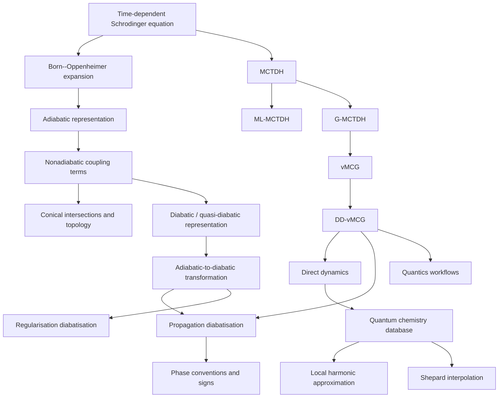

## Directory Links
Use the links below to jump directly to any of the topics outlined in the knowledge map.

[Born--Oppenheimer expansion](../02_Born_Oppenheimer_and_Nonadiabaticity/01_bornhuang_expansion.md)  
