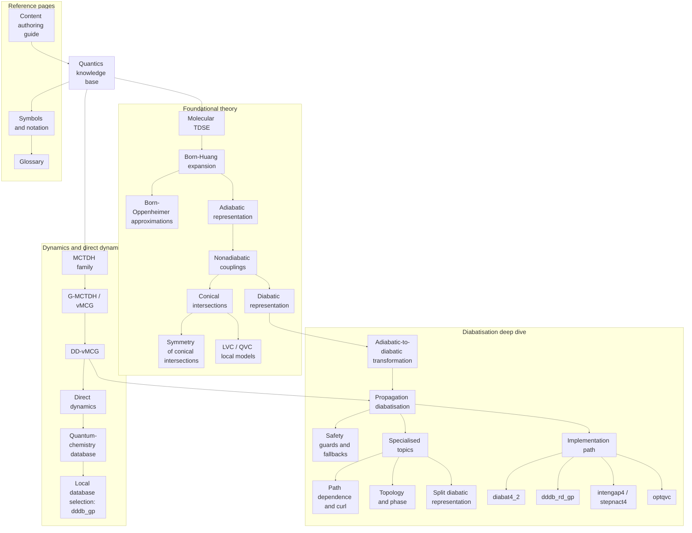

# Knowledge Map

This map is a conceptual route through the site, not a full directory listing. The clickable nodes point to section hubs or to especially useful anchor pages; the more detailed derivations, code notes, and specialised topics are linked from those hub pages.

```mermaid
%%{
    init: {
    "themeVariables": {"fontSize": "35px"}, 
    "flowchart": {"nodeSpacing": 65, "rankSpacing": 85}
    }
}%%

graph TD

    ROOT["Quantics knowledge base"]

    subgraph FOUNDATION["Foundational theory"]
        TDSE["Molecular TDSE"]
        BO["Born-Huang expansion"]
        BOGROUP["Born-Oppenheimer approximations"]
        ADREP["Adiabatic representation"]
        NAC["Nonadiabatic couplings"]
        CI["Conical intersections"]
        SYMCI["Symmetry of conical intersections"]
        DIABREP["Diabatic representation"]
        QVC["LVC / QVC local models"]
    end

    subgraph DYNAMICS["Dynamics and direct dynamics"]
        MCTDH["MCTDH family"]
        GMCTDH["G-MCTDH / vMCG"]
        DDVMCG["DD-vMCG"]
        DD["Direct dynamics"]
        QCDB["Quantum-chemistry database"]
        DDDBGP["Local database selection: dddb_gp"]
    end

    subgraph DIAB["Diabatisation deep dive"]
        ADT["Adiabatic-to-diabatic transformation"]
        PROP["Propagation diabatisation"]
        SAFETY["Safety guards and fallbacks"]
        SPECIAL["Specialised topics"]
        PATH["Path dependence and curl"]
        TOPO["Topology and phase"]
        SPLIT["Split diabatic representation"]
        CODEPATH["Implementation path"]
        DIABAT42["diabat4_2"]
        RDGP["dddb_rd_gp"]
        INTSTEP["intengap4 / stepnact4"]
        OPTQVC["optqvc"]
    end

    subgraph REFS["Reference pages"]
        SYMBOLS["Symbols and notation"]
        GLOSSARY["Glossary"]
        AUTHORING["Content authoring guide"]
    end

    ROOT --> TDSE
    ROOT --> MCTDH
    ROOT --> SYMBOLS

    TDSE --> BO
    BO --> BOGROUP
    BO --> ADREP
    ADREP --> NAC
    NAC --> CI
    CI --> SYMCI
    NAC --> DIABREP
    CI --> QVC
    DIABREP --> ADT

    MCTDH --> GMCTDH
    GMCTDH --> DDVMCG
    DDVMCG --> DD
    DD --> QCDB
    QCDB --> DDDBGP

    DDVMCG --> PROP
    ADT --> PROP
    PROP --> SAFETY
    PROP --> SPECIAL
    SPECIAL --> PATH
    SPECIAL --> TOPO
    SPECIAL --> SPLIT

    PROP --> CODEPATH
    CODEPATH --> DIABAT42
    CODEPATH --> RDGP
    CODEPATH --> INTSTEP
    CODEPATH --> OPTQVC

    SYMBOLS --> GLOSSARY
    AUTHORING --> ROOT

    click ROOT "../" "View site home"
    click BO "../02_Born_Oppenheimer_and_Nonadiabaticity/beginer/01_bornhuang_expansion.html" "View Born-Huang derivation"
    click BOGROUP "../02_Born_Oppenheimer_and_Nonadiabaticity/intermediates/int01_group_born_approximations.html" "View grouped Born-Oppenheimer approximations"
    click ADREP "../02_Born_Oppenheimer_and_Nonadiabaticity/beginer/02_adiabatic_approximations.html" "View adiabatic approximations"
    click NAC "../02_Born_Oppenheimer_and_Nonadiabaticity/intermediates/int02_conical_intersections.html" "View formal NACV and conical-intersection notes"
    click CI "../02_Born_Oppenheimer_and_Nonadiabaticity/beginer/04_conical_intersections.html" "View conical-intersection introduction"
    click SYMCI "../02_Born_Oppenheimer_and_Nonadiabaticity/beginer/05_symmetry_of_conical_intersections.html" "View symmetry of conical intersections"
    click DIABREP "../02_Born_Oppenheimer_and_Nonadiabaticity/beginer/03_diabatic_representation.html" "View diabatic representation"
    click QVC "../02_Born_Oppenheimer_and_Nonadiabaticity/derivations/derivations_QVC_model.html" "View QVC model derivation"

    click MCTDH "../03_MCTDH_Family/" "View MCTDH family hub"
    click DD "../05_Direct_Dynamics/" "View Direct Dynamics hub"
    click DDDBGP "../05_Direct_Dynamics/code+breakdown/subroutine_dddb_gp.html" "View dddb_gp code breakdown"

    click ADT "../06_diabatisation_deeperdive/derivations/derivations_adiab_diab_relation.html" "View adiabatic-diabatic relation"
    click PROP "../06_diabatisation_deeperdive/intermediates/int01_propagation_diabatisation_main.html" "View propagation diabatisation"
    click SAFETY "../06_diabatisation_deeperdive/intermediates/int01_propagation_diabatisation_safetyguard_breakdown.html" "View safety guards and fallbacks"
    click SPECIAL "../06_diabatisation_deeperdive/specialised_propagation_diabatisation_deepdive/" "View specialised topics"
    click PATH "../06_diabatisation_deeperdive/specialised_propagation_diabatisation_deepdive/curl_condition_path_dependence.html" "View curl condition and path dependence"
    click TOPO "../06_diabatisation_deeperdive/specialised_propagation_diabatisation_deepdive/topological_spin.html" "View topology and phase notes"
    click SPLIT "../06_diabatisation_deeperdive/specialised_propagation_diabatisation_deepdive/split_diabatic_representations_and_residual_couplings/split_diabatic_representation_and_residual_coupling.html" "View split diabatic representation"
    click DIABAT42 "../06_diabatisation_deeperdive/code+breakdown/subroutine_diabat4_2.html" "View diabat4_2 code breakdown"
    click RDGP "../06_diabatisation_deeperdive/code+breakdown/subroutine_dddb_rd_gp.html" "View dddb_rd_gp code breakdown"
    click INTSTEP "../06_diabatisation_deeperdive/code+breakdown/subroutine_integap4_stepnact.html" "View intengap4 and stepnact4"
    click OPTQVC "../06_diabatisation_deeperdive/code+breakdown/subroutine_optqvc.html" "View optqvc"

    click SYMBOLS "../10_References_Guides/Symbols_and_notations.html" "View symbols and notation"
    click GLOSSARY "../10_References_Guides/glossary.html" "View glossary"
    click AUTHORING "../10_References_Guides/content_authoring_guide.html" "View content authoring guide"
```

## Selected Entry Points

- [Born-Oppenheimer and Nonadiabaticity](../02_Born_Oppenheimer_and_Nonadiabaticity/)
- [Born-Huang expansion](../02_Born_Oppenheimer_and_Nonadiabaticity/beginer/01_bornhuang_expansion.html)
- [Conical intersections](../02_Born_Oppenheimer_and_Nonadiabaticity/beginer/04_conical_intersections.html)
- [Direct Dynamics](../05_Direct_Dynamics/)
- [Diabatisation Deep Dive](../06_diabatisation_deeperdive/)
- [Propagation diabatisation](../06_diabatisation_deeperdive/intermediates/int01_propagation_diabatisation_main.html)
- [Specialised diabatisation topics](../06_diabatisation_deeperdive/specialised_propagation_diabatisation_deepdive/)
- [Symbols and notation](../10_References_Guides/Symbols_and_notations.html)
- [Glossary](../10_References_Guides/glossary.html)
