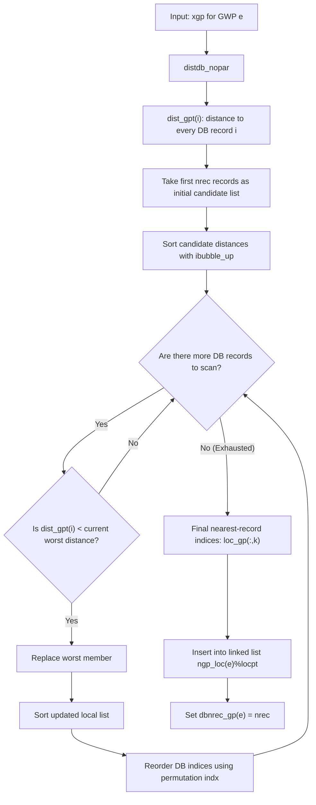
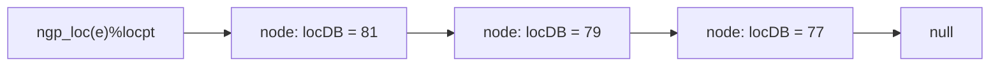

# subroutine ``dddb_gp``: building the dynamic local database for one GWP
## The role of this routine

`dddb_gp` constructs the small, dynamic database associated with one Gaussian wavepacket, indexed by `e`.

The full direct-dynamics database may contain many records. Each record corresponds to a previously computed geometry, together with associated electronic-structure information. But when the code needs a local interpolation or local model around one GWP geometry, it does not usually want to use the whole database. Instead, it wants a small set of nearby records.

That is the job of this routine.

Given one GWP geometry,

```fortran
xgp(ndofddpes)
```

the routine computes the distance from `xgp` to every database record, selects the nearest `nrec` records, and stores their full database indices in a linked list:

``` fortran
ngp_loc(e)%locpt
```
So the purpose is not to create new quantum-chemistry data. It is to create a local lookup list telling later routines which existing database records are closest to this GWP.

$$
\begin{align}
x_{\text{gp}} \rightarrow \{\text{distances to all DB record}\} \rightarrow \rightarrow \{\text{nearest }n_{rec}\text{ to all DB record }\} \rightarrow \text{ngp_loc(e)\%locpt}
\end{align}
$$



## 1. Inputs and immediate exit

The routine begins as:

```fortran
subroutine dddb_gp(numdb,xgp,e)

use dirdyn

implicit none

integer(long), intent(in)                    :: e,numdb
real(dop), dimension(ndofddpes), intent(in)  :: xgp
```

The three inputs are:

```fortran
numdb
```

the number of records in the full database;

```fortran
xgp(ndofddpes)
```

the coordinate vector of the current GWP;

```fortran
e
```

the GWP index, used to decide which local linked list is being built.

The first active line is:

```fortran
if (numdb .eq. 0) return
```

This is a guard clause. If the full database contains no records, then there is no local database to build.

## 2. Distance calculation

The routine then initializes

``` fortran
mindist = 0.0_dop
```

and calls

```fortran
call distdb_nopar(xgp(:),iloc,dist_gpt(:),mindist,mindisp,numdb)
```

The important output here is:

```fortran
dist_gpt(numdb)
```

This array stores the distance from the current GWP geometry to every database geometry.

In plain terms:

``` text
dist_gpt(i)=d(xgp​,x_{DB,i}​)
```

`i` is the full database record index.

The variables `iloc`, `mindist`, and `mindisp` are returned by `distdb_nopar`, but in this routine they are not used after the call. For dddb_gp, the main object is the complete distance array `dist_gpt(:).`

## 3. Choosing the local DB size
The routine then sets

```fortran
nrec = min(dbnrec,numrec)
```

Here:

```fortran
dbnrec
```

is the number of records currently in the full database, while

```fortran
numrec
```

is the requested maximum size of the local database.

So

```fortran
nrec=min(dbnrec,numrec)
```
means:

keep at most numrec records, but if the full database has fewer than that, keep only what exists.

For example, if the full database has 100 records and numrec = 10, then

```fortran 
nrec = 10
```

If the full database has only 6 records, then

```fortran
nrec = 6
```

## 4. Working arrays

The routine allocates three arrays:

``` fortran
allocate(dist_gp(nrec))
allocate(loc_gp(nrec,2),indx(nrec))
```

These arrays have different roles.

``` fortran
dist_gpt(numdb)
```
is the full distance array. It contains the distance from this GWP to every database record.

``` fortran
dist_gp(nrec)
```

is the current local candidate list. It contains only the distances of the best nrec records found so far.

``` fortran
loc_gp(nrec,2)
```

stores the full database indices corresponding to the entries in dist_gp.

The second dimension of `loc_gp` is important. It has two columns because the code uses a ping-pong buffer: one column is the current valid list, while the other is used as scratch space when reordering the list after a sort. (see later in ibubble sort)

```fortran
indx(nrec)
```
is a temporary permutation array returned by ibubble_up. It says where each sorted element came from in the previous unsorted list.

So the main relationship is:

$$dist\_gp(j)\leftrightarrow loc\_gp(j,k)$$

where `k` is the currently active column of `loc_gp`.

## 5. Initial local list
The code begins by taking the first `nrec` database records:

``` fortran
do i=1,nrec
   dist_gp(i) = dist_gpt(i)
   loc_gp(i,1) = i
enddo
```

At this stage, no nearest-neighbour logic has happened yet. The code simply says:

> use records `1` to `nrec` as the first candidate set as our initial guess (since data insertion within a single run is always sequential as gwps travels away from the FC point)

So initially:

``` fortran
dist_gp(i)  = distance to DB record i
loc_gp(i,1) = DB record i
```

For example, if nrec = 3:

``` fortran
dist_gp      = [dist_gpt(1), dist_gpt(2), dist_gpt(3)]
loc_gp(:,1)  = [1,           2,           3]
```

This is only a starting point. The code will sort this list and then scan the rest of the database to replace worse candidates with better ones.

## 6. ``ibubble_up``: sorting distances and carrying indices with them

The first sort is:

``` fortran
call ibubble_up(dist_gp,loc_gp(1,1),nrec)
```
The sorting routine is:

``` fortran
subroutine ibubble_up (vector, ivector, vecdim)

integer vecdim,i,j
integer ivector(vecdim),iswap
real*8  vector(vecdim),swap

do i = 1,vecdim
   ivector(i)=i
enddo

do i = 1,vecdim-1
   do j = i+1,vecdim
      if (vector(i) .gt. vector(j)) then
         swap = vector(i)
         vector(i) = vector(j)
         vector(j) = swap

         iswap = ivector(i)
         ivector(i) = ivector(j)
         ivector(j) = iswap
      endif
   enddo
enddo
```

Despite the name, this is not quite the usual adjacent-swap bubble sort. It is more like a simple $\BigO(n^2)$ exchange sort: for every position i, it compares against all later positions j and swaps when a smaller value is found.

The essential point is that it sorts `vector` from smallest to largest, and it applies the same swaps to `ivector` so that `ivector` tracks the original locations of the sorted values.

For the first call,

``` fortran
call ibubble_up(dist_gp,loc_gp(1,1),nrec)
```
the integer vector is `loc_gp(:,1)`. `ibubble_up` first sets it to

``` fortran
[1, 2, 3, ..., nrec]
```
and then reorders it as it sorts `dist_gp`.

Example:

Before sorting:

``` fortran
DB record:   1     2     3
distance:   0.50  0.20  0.90

dist_gp     = [0.50, 0.20, 0.90]
loc_gp(:,1) = [1,    2,    3]

After sorting:

dist_gp     = [0.20, 0.50, 0.90]
loc_gp(:,1) = [2,    1,    3]
```

Now the local list is ordered from nearest to farthest, and the farthest current candidate is always at the end:

``` fortran
dist_gp(nrec)
```
This is the key to the rest of the algorithm.

## 7. Scanning the rest of the full database

After sorting the first nrec records, the code scans records

``` fortran
nrec+1, ..., numdb
```

using:

``` fortran
k=1
l=2
do i=nrec+1,numdb
   if (dist_gpt(i) .lt. dist_gp(nrec)) then
      dist_gp(nrec) = dist_gpt(i)
      loc_gp(nrec,k) = i
      call ibubble_up(dist_gp,indx,nrec)
      do j=1,nrec
         loc_gp(j,l) = loc_gp(indx(j),k)
      enddo

      j=k
      k=l
      l=j
   endif
enddo
```
The logic is:
``` fortran
dist_gp(nrec)
```
is the largest distance in the current local list, because dist_gp is always sorted ascending.

So the test
``` fortran
if (dist_gpt(i) .lt. dist_gp(nrec)) then
```
asks:

> is this new database record closer than the worst member of my current local list?

If no, the record is ignored.

If yes, the record belongs in the local database. The code replaces the current farthest record:
``` fortran
dist_gp(nrec) = dist_gpt(i)
loc_gp(nrec,k) = i
```
Then it sorts the updated distance list:

``` fortran
call ibubble_up(dist_gp,indx,nrec)
```
This time, ibubble_up does not directly sort `loc_gp`. It sorts `dist_gp` and returns the permutation in indx.

That permutation is then applied manually:
```fortran
do j=1,nrec
   loc_gp(j,l) = loc_gp(indx(j),k)
enddo
```
In words:

> reorder the database indices in the same way the distances were reordered.

The reason for using `loc_gp(:,l)` rather than overwriting `loc_gp(:,k)` is to avoid corrupting the old list while still reading from it.

## 8. The ping-pong buffer in loc_gp

The variables `k` and `l` select which column of loc_gp is current and which column is scratch.

Initially:
``` fortran
k = 1
l = 2
```
So:
```fortran
loc_gp(:,1) = current valid DB-id list
loc_gp(:,2) = scratch column
```
After a replacement and sort, the code writes the reordered list into column l:

loc_gp(j,l) = loc_gp(indx(j),k)

Then it swaps k and l:
```fortran
j=k
k=l
l=j
```
So if before:
```fortran
k = 1
l = 2
```
then after:
```fortran
k = 2
l = 1
```
Now column 2 is the current valid list, and column 1 becomes scratch.

This is a standard double-buffer pattern:

```text
read from current column k
write reordered result to scratch column l
swap k and l
repeat
```
The reason it matters is that a permutation can overwrite values that are still needed. The second column avoids that.

## 9. Worked example of the replacement step

Suppose

```fortran
nrec = 3
```
and after the initial sort we have:
```fortran
dist_gp      = [0.20, 0.50, 0.90]
loc_gp(:,1)  = [2,    1,    3]
k = 1
l = 2
```
This means:
```text
nearest current record  = DB record 2, distance 0.20
next nearest            = DB record 1, distance 0.50
current worst candidate = DB record 3, distance 0.90
```
Now suppose the next database record is
```fortran
i = 4
dist_gpt(4) = 0.10
```
The test succeeds because `0.10 < 0.90`.
The code replaces the worst entry:
```fortran
dist_gp(nrec) = dist_gpt(i)
loc_gp(nrec,k) = i
```
so now:
```fortran
dist_gp      = [0.20, 0.50, 0.10]
loc_gp(:,1)  = [2,    1,    4]
```
Then:
```fortran
call ibubble_up(dist_gp,indx,3)
```
sorts the distances:

```fortran
dist_gp = [0.10, 0.20, 0.50]
indx    = [3,    1,    2]
```
The permutation says:
```text
new sorted element 1 came from old position 3
new sorted element 2 came from old position 1
new sorted element 3 came from old position 2
```
The code applies this to the DB indices:
```fortran
loc_gp(j,l) = loc_gp(indx(j),k)
```
Since k = 1 and l = 2:
```fortran
loc_gp(:,2)
= [loc_gp(3,1), loc_gp(1,1), loc_gp(2,1)]
= [4,           2,           1]
```
Then k and l are swapped:
```fortran
k = 2
l = 1
```
So the valid current list is now:
```fortran
loc_gp(:,k) = loc_gp(:,2) = [4, 2, 1]
```
which correctly matches:
```fortran
dist_gp = [0.10, 0.20, 0.50]
```
## 10. Creating the linked list

After the nearest nrec records have been selected, the code writes them into the linked list for GWP e:
``` fortran
call list_init(ngp_loc(e)%locpt)

do i=1,nrec
  call list_insert(loc_gp(i,k),ngp_loc(e)%locpt)
enddo

dbnrec_gp(e) = nrec
```
At this point:
```fortran
loc_gp(:,k)
```
contains the selected full database record indices.

The destination is `ngp_loc(e)%locpt`. This is the head pointer of the linked list associated with GWP `e`.

So the final operation is:

$$loc\_gp(:,k)\rightarrow ngp\_loc(e)\%locpt.$$

## 11. Linked-list declarations

The linked-list types are:
``` fortran
type nextptr
  integer(long)          :: locDB
  type(nextptr), pointer :: next
end type nextptr

type list
  type(nextptr), Pointer :: locpt
endtype list

type(list), dimension(:), allocatable, save :: ngp_loc
```
The node type is:
```fortran
type nextptr
```
Each node stores `locDB`, the full database record number, and

```fortran
next
```
a pointer to the next node in the chain.

The wrapper type is:
```fortran
type list
```
It contains only:
```fortran
locpt
```
which is the head pointer of the linked list.

So:

```fortran
ngp_loc(e)
```
is the linked-list wrapper for GWP `e`, and
```fortran
ngp_loc(e)%locpt
```
is the actual head pointer.

A linked list containing records 81, 79, and 77 looks like:


Each node contains a database record number and a pointer to the next node.

## 12. ```list_init```

The initialization routine is:
```fortran
subroutine list_init(head)
implicit none
type(nextptr), pointer :: head

nullify(Head)

end subroutine list_init
```
Fortran is case-insensitive, so `Head` and `head` are the same variable.

This routine makes the `head` pointer point to nothing:

```fortran
nullify(head)
```
In plain language:

mark the linked list as empty.

So after:
```fortran
call list_init(ngp_loc(e)%locpt)
```
we have:
```fortran
ngp_loc(e)%locpt => null
```
Important subtlety: `nullify(head)` does not deallocate any existing nodes. It only disconnects the pointer. Therefore, if this list already contains allocated nodes and no deletion routine was called earlier, this would lose access to those nodes. That would be a memory leak. If the code guarantees that list_init is only called on an empty/uninitialized list, or if a separate cleanup routine runs before this, then it is fine. But from this snippet alone, list_init is a pointer reset, not a list destructor.

## 13. list_insert
The subroutine inserts at the head. Not what the comments say. 
```fortran
allocate(new_node)

new_node%locDB = loc

if (associated(head)) then
   new_node%next => head
else
   new_node%next => null()
endif

head => new_node
```

This creates a new node, stores the database record index in it, points the new node at the old head, and then makes the new node the new head.

So insertion is:
```text
new node -> old head
head     -> new node
```
This is head insertion, not append-to-end insertion.


For example, if the code inserts `2, then 3, then 5`,

the linked list becomes:
```text
head -> 5 -> 3 -> 2 -> null
```
not:
```text
head -> 2 -> 3 -> 5 -> null
```
So if ``loc_gp(:,k)`` is sorted nearest-to-farthest, the linked list will store it in reverse order: farthest-to-nearest.


## 14. Reading the linked list later

Later code reads the list using the standard pointer-walk pattern:
```fortran
current => ngp_loc(num_gp)%locpt

do irec = 1, dbnrec_gp(num_gp)
   loc(irec) = current%locDB
   current => current%next
enddo
```
This means:

1. Start at the head pointer.
3. Copy the current node’s database index into `loc(irec)`.
3. Move to the next node.
4. Repeat `dbnrec_gp(num_gp)` times.

The statement:
``` fortran
current => current%next
```
means:

make current point to the next node in the chain.

So `ngp_loc(e)%locpt` is the persistent linked-list storage, while `loc(:)` is a temporary ordinary array version used by whatever routine is reading the local database.

## 15. What the algorithm achieves

The core algorithm is a top-nrec nearest-neighbour selection.

It does not sort the entire database. Instead, it keeps a small sorted list of the best records found so far.

The invariant after each successful replacement is:
```text
dist_gp is sorted ascending
loc_gp(:,k) contains the matching full DB indices
dist_gp(nrec) is the current worst accepted distance
```
Then, for every remaining database point, the code asks:
`Is this point better than the worst accepted point?`
If yes, replace the worst point and sort the small list again.

Because nrec is small, this simple repeated sort is acceptable. If `nrec = 10`, the $\BigO(nrec^2)$ sort is cheap. The expensive part is usually the distance evaluation over the full database, not the sorting of the small local list.


## 16. Compact summary

dddb_gp takes the geometry of one GWP and builds its local dynamic database. It first computes the distance from the GWP to every full database record. It then keeps only the nearest nrec records using a small sorted candidate list. dist_gp stores the candidate distances, while loc_gp(:,k) stores the corresponding full database indices. Whenever a closer point is found, the code replaces the current farthest accepted point, re-sorts the small list with ibubble_up, and uses the returned permutation indx to keep the database indices aligned with the distances.

At the end, the selected database indices are inserted into the linked list ngp_loc(e)%locpt, and dbnrec_gp(e) records how many local database entries this GWP has. The main caveat is that list_insert appears to insert at the head, despite the comment saying “end”, so the linked-list order is reversed relative to the sorted loc_gp(:,k) order.
