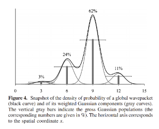
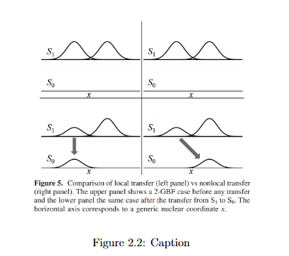

# A Straightforward Method of Analysis for Direct Quantum Dynamics 2010
MCTDH generates delocalized wavepackets. In contrast, Gaussian functions used in the DD-vMCG approach are localised around their centres and can be seen as following quantum trajectories. Each one will contribute to some extent to the global wavepacket. The problem here is that the basis set is not orthogonal, which makes the definition of individual contributions ambiguous. We propose here a solution in the form of a new analysis derived from the Mulliken analysis of orbital populations.

## Normalization condition
For a given electronic state $s$ the nuclear wavepacket is expanded in a basis set of time-dependent parametrized Gaussian functions, the GBFs, $g_j(\mat Q,t)$:
$$
\begin{align}
    \psi^{s}(\mat Q,t)=\sum_j A_j^{(s)}(t)g_j(\mat Q,t)
\end{align}
$$

where $j$ is the label of the GBF that are non-orthogonal:

$$
\begin{align}
    \Smat_{jj'}=\int{g_j^*(\mat Q,t)g_{j'}(\mat Q,t)d\mat Q}
\end{align}
$$

So, the total molecular wavepacket is thus:

$$
\begin{align}
    \ket{\Psi(\mat Q,t)}=\sum_s\psi^{(s)}(\mat Q,t)\ket{s;\mat Q} = \sum_j g_j(\mat Q,t)\sum_sA_j^{(s)}(t)\ket{s;\mat Q}\label{eq:born-huang}
\end{align}
$$

which means that each GBF has a different coefficient on each electronic states. 

The population on electronic state $s$ is just the total probability in that nuclear component:

$$
\begin{align}
    P^{(s)}(t)&=\int | \psi^{s}(\mat Q,t)|^2 d\mat Q\\&=\sum_{jj'}A_j^{(s)*}A_{j'}^{(s)}\int{g_j^*(\mat Q,t)g_{j'}(\mat Q,t)d\mat Q}\\
    &=\sum_{jj'}A_j^{(s)*}A_{j'}^{(s)}\Smat_{jj'}(t)
\end{align}
$$

Consequently, the normalization reads (braket is used to denotes integration over electronic indices):

$$
\begin{align}
    \int \braket{\Psi(\mat Q,t)} d\mat Q &= \sum_{ss'}\delta_{ss'}\int | \psi^{s}(\mat Q,t)|^2 d\mat Q\\
    &=\sum_s P^{(s)}(t)=1
\end{align}
$$

Hence:

$$
\begin{align}
   \sum_{jj'}\Smat_{jj'}(t) \sum_sA_j^{(s)*}A_{j'}^{(s)}=1
\end{align}
$$

implies cross terms also contribute to the total wavepacket which akins to atomic orbitals contributions to the final molecular orbitals. 

## Mulliken population analysis
### MO expansion and overlap
* Atomic orbitals (AO):${\chi_{\mu}}$, non-orthogonal, with overlap matrix $\Smat_{\mu\nu}=\braket{\chi_\mu}{\nu}$
* Molecular orbitals (MO):

    $$
    \ket{\phi_i}=\sum_{\mu}\Cmat_{\mu i}\ket{\chi_\mu}
    $$

* For a closed-shell system, the density matrix in the AO basis:

    $$
    \mat D_{\mu\nu}=2\sum_{i\in\text{occ}}\Cmat_{\mu i}\Cmat_{\nu i}^*
    $$

### Electron number and “population per AO”

The total number of electron is
$$
\begin{align}
    N = \sum_{\mu\nu}\mat D_{\mu\nu}\Smat_{\mu\nu}
\end{align}
$$

Mulliken associated an electron population with each AO $\mu$,gross orbital product  $\text{GOP}_{\mu}$ such that

$$
\begin{align}
    N = \sum_{\mu}\text{GOP}_{\mu}
\end{align}
$$

Hence:
$$
\begin{align}
    \text{GOP}_{\mu} =\sum_\nu \mat D_{\mu\nu}\Smat_{\mu\nu}=2\sum_\nu\Smat_{\mu\nu}\sum_{i\in\text{occ}}\Cmat_{\mu i}\Cmat_{\nu i}^*
\end{align}
$$

Which we could see it has a structure of sum over dummy index of ($\text{coef}_{\text{dummy}}\times\text{coef}_{\text{of interest}}\times\text{overlap}$).

## PGP vs GGP
The pseudo Gaussian population (PGP) is just:

$$
\begin{align}
    \text{PGP}_j^{(s)}(t)=|A_j^{(s)}(t)|^2
\end{align}
$$

and because the GBFs overlap, $\sum_j\text{PGP}_j^{(s)}\neq P^{(s)}$ in general as the cross terms from the overlaps are missing. 

Instead the gross Gaussian population (GGP) is a better measure:

$$
\begin{align}
    \text{GGP}_j^{(s)}(t)=\real{\sum_{j'}\Smat_{jj'}(t) \sum_sA_j^{(s)*}(t)A_{j'}^{(s)}(t)}\label{eq:ggp}
\end{align}
$$

which is chosen so that:

$$
\begin{align}
    P^{(s)}&=\sum_{jj'}A_j^{(s)*}A_{j'}^{(s)}\Smat_{jj'}(t)=\sum_j\text{GGP}_j^{(s)}\\
    1&=\sum_sP^{(s)}(t)=\sum_s\sum_j\text{GGP}_j^{(s)}
\end{align}
$$

This in fact also has the structure of sum over dummy index of ($\text{coef}_{\text{dummy}}\times\text{coef}_{\text{of interest}}\times\text{overlap}$).

In eq\ref{eq:ggp}, only the real part is taken as quoted ''The imaginary parts can be
ignored as they sum up to zero. In our calculations, the
individual imaginary parts were always small''. 

## Example exploration
consider a one-dimensional case with a single electronic state. The global wavepacket is expanded in a basis
set of four GBF,

$$
\begin{align}
    \psi(\mat Q,t)=\sum_j^4 A_j(t)g_j(\mat Q,t)
\end{align}
$$

Then the global density of probability is:

$$
\begin{align}
    | \psi(\mat Q,t)|^2=\sum_{j.j'=1}^4A_j(t)^*A_j(t)g_j^*(\mat Q,t)g_j(\mat Q,t)
\end{align}
$$

which are represented by black curves in the figure below

The four gray Gaussian curves are the weighted densities of probability of each Gaussian functions $\vert A_j(t)g(\mat Q,t)\vert^2$. Clearly, the global density is not the sum of these, since nonzero overlaps  create interference terms (as when overlapping atomic orbitals create bonding or antibonding molecular orbitals).

Assume each GWPs is normalized and real with width $1/\sqrt2$ in mass-frequency scaled normal coordinates (non-recentred)

$$
\begin{align}
    g_j(\mat Q,t)=\frac{\ee^{-\frac{1}{2}\lrp{\mat Q-\mat Q_j}^2}}{\pi^{1/4}}
\end{align}
$$

and all coefficient A real. In the figure, the centres are chosen $\{\mat Q_j(t)\}=\{3,6,9,12\}$ and coefficients $\{A_j\}\propto\{1,3,5,2\}$. The overlap between two neighboring
Gaussian basis functions is approximately 11\% and is virtually
zero between functions further apart. The PGP and the GGP
are $\{\text{PGP}_j(t)=\{2\%,20\%,56\%,9\%\}\}$
and $\{\text{GGP}_j(t)=\{3\%,24\%,62\%,11\%\}\}$. The former do not add up to
one but 87\% (as expected due to nonzero overlaps), while the
latter add up to one by construction. Note that the example
illustrated here is a case where all interferences are constructive
(coefficients and overlaps are all real and positive). The sum of
the PGP is less than one, and interfering contributions account
for the rest (13\% of the global density of probability). In
practice, the coefficients and the overlaps are complex numbers,and the sum of the PGP can be much greater than one when
there are destructive interferences.

In fig ggp density, the four vertical gray bars represent the four GGP
(their respective heights are indicated) positioned at the centers
of the Gaussian basis functions. They can be considered as a
reduction of the quantum distributions - the global density of
probabilitys - to a statistical sample of four representative positions with their respective weights. Following these four
positions and weights along time can be seen as following four
“quantum trajectories” that best represent the global wavepacket.

The GGP are thus effective indicators of the actual weight
of the Gaussian basis functions within the global density of
probability. They account for the individual contributions (as
the PGP do) but also for the interferences due to overlapping
basis functions. As for Mulliken’s gross orbital populations, the
formula used to decide how much of the interfering contribution
is to be attributed to a particular orbital is somewhat arbitrary
and can be criticized. Nevertheless, this represents an operational
procedure that helps the interpretation of the whole quantum
distribution in terms of a few weighted quantum trajectories in
much the same way as delocalized molecular orbitals can be
seen as superpositions of localized atomic orbitals.

## Nonlocality in time and space
### semiclassical picture: Nonlocal in time only
In surface hopping, many independent classical trajectory are ran and moves $S_1$ and at some time $t_{hop}$ may hop to $S_0$ at its own geometry. So there is no communication between trajectoris. Thus the only “nonlocality” you see is different trajectories hop at different times (and thus different geometries).I.e. nonlocality manifests in the statistical spreading of the points 
where surface hopping occurs. And the population transfer occurs
at different times for different trajectories.

So for each single trajectory the hop is local in space (it hops where it is),but across the ensemble, hop times/positions are spread out → nonlocal in time (and statistically in geometry).

### Quantum picture: Added possisble nonlocality in space
In addition to how the GWPs can transfer from different electronic states at different time as each follows its own quantum trajectory. Further, the GBFs are coupled through the Hamiltonian and through their overlaps That is the $A_j^{(s)}$ are coupled, the GGPs involve overlaps $\Smat_{jj'}$ and the total wavepacket is a coherent superposition of all GBFs. (here I am using coherent to refer to the fact that the full complex amplitudes including the relative phases of all Gaussian wavepackets are propagated and used such that the interference between them is treated prooperly and not averaged out)

Because of this coupling, there are two logically different ways population can be transferred from S1 to S0
#### local in space j=j'
Population leaves $S_1$ and appears on $S_0$ on the same GBF:

$$
\begin{align}
    \text{GGP}_j^{(1)}(t)\downarrow, \quad \text{GGP}_j^{(0)}(t)\uparrow, \quad \text{GGP}_{j\neq j'}^{(s)}(t)\text{ roughly unchanged}
\end{align}
$$

Physically: the part of the wavepacket following trajectory j crosses the seam and hops there.
#### Nonlocal in space j$\neq$j'
Population leaves S1 on one GBF and appears on S0 attached to a different GBF:

$$
\begin{align}
    \text{GGP}_j^{(1)}(t)\downarrow, \quad \text{GGP}_{j'}^{(0)}(t)\uparrow, \quad {j\neq j'}^{(s)}
\end{align}
$$

In the original text *Results will be called nonlocal in space if the population transfer involves a correlated decrease of $\text{GGP}_j^{(1)}(t)$ and increase of $\text{GGP}_{j'}^{(0)}(t)$ with $j\neq j'$. This is quantum nonlocality (quantum trajectories communicate with each other at all times) as the different trajectories talk to each other because the basis is non-orthogonal and the coefficients are coupled. A piece of the wavepacket that was spatially centred around one geometry can re‑appear attached to another geometry.*

This can be seen figuratively in fig non-local vs local. Left panel shows local transfer. In top pannel, two Gaussian on S1 at different x and no population on S0. At the bottom, one of the S1 Gaussian has lost weight and the S0 Gaussian diretly underneath it at same x has hained weight showed by vertical arrow. So for that GBF index $j$; $\text{GGP}_j^{(1)}(t)$ decreased and $\text{GGP}_j^{(0)}(t)$ increased while the other GBFs unaffected. So the hop happend locally in space at that trajectory's geometry

Right pannel shows non-local transfer. Same intialization condition as the left pannel in the top right. While in the bottom, the left S1 Gaussian has lost populations but the S0 Gaussian that gains population is the right one at a different x showed by diagonal arrow. So $\text{GGP}_j^{(1)}(t)$ decreases while $\text{GGP}_{j'}^{(0)}(t)$ increases. So the populations has jumped between trajectories as well as between states which are non-local in space.

But in general, this paper found that nonadiabatic events are rather local in space but not local in time. That is most population transfer from S1 to S0 as an example occurs such that each GBF's S1 and S0 GGPs are roughly mirror images and transfer is mainly local in space ($j=j'$). But different GBFs reach the seam and transfer population at different times (nonlocal in time)

### How the GGP changes depending on the nature of the transfer
Since the GBFs are localized in coordinate space, $\Smat_{jj'}$ is close to 1 when $\mat Q_j=\mat Q_j'$(when they overlap)