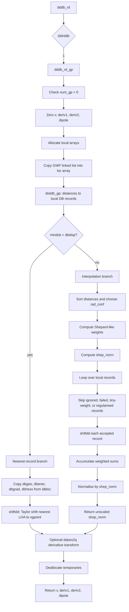

# `dddb_rd_gp`: read and interpolate a GWP-local diabatic DD database

## Big picture

`dddb_rd_gp` is the **GWP-local database reader** used when

```fortran
iddrddb == 1
```

in `dddb_rd`.

Its job is to evaluate a **diabatic local harmonic approximation** at the current geometry `xgpoint`, using the small database assigned to the current Gaussian wavepacket, indexed by `num_gp`.

In the wider DD-vMCG setting, the dynamics uses Gaussian wavepackets and stores quantum-chemistry information in a database, including energies, gradients, and Hessians. Those data are then reused through local harmonic approximations and interpolation rather than recalculating the potential at every propagation step. This is the same broad database philosophy described in the DD-vMCG and propagation-diabatisation literature. (pratical diabatisation scheme)

`dddb_rd_gp` does **not** itself carry out propagation diabatisation. It assumes that the database already contains diabatic quantities:

```fortran
dbener
dbgrad
dbhess
dbdipmom
```

and returns the diabatic potential matrix, gradients, and Hessians at `xgpoint`.

The routine has two possible evaluation modes:

1. **Nearest-point Taylor shift**  
   If the closest usable local database record is sufficiently close, the routine uses that single record and shifts its local harmonic model to `xgpoint`.

2. **Shepard-weighted interpolation of shifted local harmonic models**  
   If no database point is close enough, the routine evaluates several local harmonic models at `xgpoint`, then averages them with distance-based Shepard-like weights.

The result is a local diabatic PES estimate of the form

$$
\W(x), \qquad
\frac{\partial \W}{\partial x_a}, \qquad
\frac{\partial^2 \W}{\partial x_a \partial x_b}.
$$

---

## Where it is called

`dddb_rd_gp` is selected by the dispatcher `dddb_rd`:

```fortran
if (iddrddb .eq. 0) then
   call dddb_rd_full(...)
else if (iddrddb .eq. 1) then
   call dddb_rd_gp(...)
else if (iddrddb .eq. 2) then
   call dddb_rd_ind(...)
else if (iddrddb .eq. 3) then
   call dddb_rd_local(...)
else if (iddrddb .eq. 4) then
   call dddb_rd_shepgrad(...)
endif
```

So this page concerns only the branch

```fortran
iddrddb == 1
```

which means: use the **small local database attached to the current GWP**.

---

## Inputs and outputs

### Main inputs

```fortran
xgpoint(ndofddpes)
```

The current geometry or coordinate vector where the diabatic PES is required.

```fortran
ltransder
```

If true, and if `lddtrans` is also true, the routine may transform derivatives from DD-PES coordinates into dynamics coordinates at the end.

```fortran
lvonly
```

Nominally an “energy only” flag. In this routine, however, it does **not** stop gradients and Hessians from being computed. Its main practical effect here is that it suppresses the final derivative coordinate transformation:

```fortran
if (lddtrans.and.ltransder.and. .not.lvonly) &
   call ddpes2q(deriv1,deriv2,order)
```

```fortran
lforce
```

Assigned to the saved logical variable `initial`:

```fortran
initial = lforce
```

but `initial` is not subsequently used inside this GP routine.

---

### Main outputs

```fortran
v(nddstate,nddstate)
```

The diabatic potential matrix at `xgpoint`.

```fortran
deriv1(ndofddpes,nddstate,nddstate)
```

The first derivative of every diabatic potential matrix element with respect to every DD-PES coordinate:

$$
\texttt{deriv1}(a,i,j)
=\frac{\partial V_{ij}}{\partial x_a}.
$$

```fortran
deriv2(ndofddpes,ndofddpes,nddstate,nddstate)
```

The second derivative matrix:

$$
\texttt{deriv2}(a,b,i,j)
=\frac{\partial^2 V_{ij}}{\partial x_a \partial x_b}.
$$

```fortran
dipole(3,nddstate,nddstate)
```

The dipole matrix components.

Important caveat: in the current code path, the dipole handling appears incomplete. In the nearest-point branch, a local array `dip` is filled from `dbdipmom`, but it is never copied into `dipole`. In the interpolation branch, `diptmp` is initialised to zero and then accumulated, but it is never loaded from `dbdipmom`. Therefore, as written, `dipole` remains zero even when `ldipdb` is true.

---

## Important global data

The local database is not a separate storage object containing its own full arrays. Instead, it is a linked-list selection of full database record numbers.

The central global data are:

```fortran
num_gp
```

The current GWP-local database index.

```fortran
dbnrec_gp(num_gp)
```

The number of full database records assigned to this GWP-local database.

```fortran
ngp_loc(num_gp)%locpt
```

The linked-list head pointer for the records assigned to GWP `num_gp`.

Each node stores a full database record number:

```fortran
type nextptr
   integer(long) :: locDB
   type(nextptr), pointer :: next
end type nextptr
```

The database arrays themselves are the full DD database arrays:

```fortran
dbgeo(ndofddpes,record)
dbener(nddstate,nddstate,record)
dbgrad(ndofddpes,nddstate,nddstate,record)
dbhess(ndofddpes,ndofddpes,nddstate,nddstate,record)
dbdipmom(3,nddstate,nddstate,record)
```

The filtering flags are:

```fortran
dbignore(record)
dbinterp(record)
```

where records are skipped if

```fortran
dbignore(record) == 1
```

or

```fortran
dbinterp(record) < 0
```

The interpolation parameters include:

```fortran
dbdisp
dbnconf
dbminwgt
dbinterord
dbinterord1
rad_conf
shep_norm
```

`rad_conf` and `shep_norm` are module variables modified by this routine. `shep_norm` is especially important because other diabatisation-related routines can use it as a measure of local database support.

---

## Temporary arrays

The routine first converts the GWP-local linked list into normal arrays.

```fortran
r1(dbnrec_gp(num_gp))
```

Distance from `xgpoint` to each local database record, in local-list order.

```fortran
loc(dbnrec_gp(num_gp))
```

Maps local-list position to full database record number.

For example:

```fortran
loc(irec) = current%locDB
```

means that local entry `irec` corresponds to full database record `loc(irec)`.

```fortran
weight(dbnrec_gp(num_gp))
```

The Shepard-like interpolation weight assigned to each local record.

```fortran
ord_dist(dbnrec_gp(num_gp))
```

Sorted copy of `r1`, used to choose the confidence radius `rad_conf`.

```fortran
gx(ndofddpes)
```

The geometry of a selected database record.

```fortran
vv, der1, der2, dip
```

Temporary copies of the nearest database record in the no-interpolation branch.

```fortran
vtmp, dertmp1, dertmp2
```

The shifted contribution from one database record after applying `shiftdd`.

```fortran
tv, tderiv1, tderiv2
```

Weighted accumulated sums over accepted database records.

---

## Mathematical model

Each database record stores a local harmonic approximation to the diabatic potential matrix. For a record centred at geometry \(x_i\), define

$$
\Delta x = x - x_i.
$$

The stored quantities are:

$$
\W_i^0,
\qquad
\partial_a \W_i^0,
\qquad
\partial_a\partial_b \W_i^0.
$$

`shiftdd` evaluates the local quadratic model at `xgpoint`:

$$
\W_i(x)
=\W_i^0
+
\sum_a
\partial_a \W_i^0 \Delta x_a
+
\frac12
\sum_{ab}
\partial_a\partial_b \W_i^0
\Delta x_a \Delta x_b,
$$

$$
\partial_a \W_i(x)
=\partial_a \W_i^0
+
\sum_b
\partial_a\partial_b \W_i^0
\Delta x_b,
$$

$$
\partial_a\partial_b \W_i(x)
=\partial_a\partial_b \W_i^0.
$$

So the routine does not merely interpolate stored energies. It first shifts each local harmonic model to the requested geometry, then either uses one shifted model or averages several shifted models.

This is the same local-harmonic database idea used in DD-vMCG: quantum-chemistry data at database points give energies, gradients, and Hessians, and the potential near a Gaussian centre is represented by a second-order Taylor expansion.

---

## Flowchart



---

# Code walkthrough

## 1. Interface and intent

The routine signature is:

```fortran
subroutine dddb_rd_gp(v,deriv1,deriv2,dipole,xgpoint,ltransder,&
           lvonly,lforce)
```

The comment block says:

```fortran
! routine to read LHA info from all points (weighted) in a small DB
! only diabatic files need to be read.
!
! num_gp denotes DB to be read - passed via dirdyn module and set in
!        gh_elements
!
! lvonly: just read energy. NB this seems to be wrong as shiftdd
! will not work!!
!
! lforce: ignore last call information and recalculate weighted 
! potential
!
! dbignore(dbnrec): Passed by module. If 1, record ignored in weighting
```

The comment already flags one of the important issues: `lvonly` is intended as an energy-only flag, but the routine still needs derivative data because `shiftdd` evaluates a local harmonic approximation.

---

## 2. Initial safety check

The first substantive check is:

```fortran
if (num_gp .le. 0) then
   routine='Dddb_rd_gp (dd_db.F90)'
   message = 'Illegal value of GWP number (num_gp) '
   call errormsg
endif
```

This protects the later access to

```fortran
ngp_loc(num_gp)%locpt
dbnrec_gp(num_gp)
```

because `num_gp <= 0` would be an invalid GWP-local database index in normal Fortran indexing.

---

## 3. Output initialisation

The outputs are zeroed immediately:

```fortran
v(:,:)=0.0_dop
deriv1(:,:,:)=0.0_dop
deriv2(:,:,:,:)=0.0_dop
dipole(:,:,:)=0.0_dop
```

The control variables are then initialised:

```fortran
linterpol=.true.
mindist=0.0_dop
idbloc=0
dv = 0.0_dop
initial = lforce
t=0
```

The key flag is:

```fortran
linterpol = .true.
```

This means: assume interpolation will be needed unless the nearest local database point is found to be sufficiently close.

`initial` is set from `lforce`, but is not used later in this routine.

---

## 4. Allocate working arrays

The routine allocates the local working arrays:

```fortran
allocate(gx(ndofddpes))
gx=0
if (dbnrec .gt. 0) then
   allocate(r1(dbnrec_gp(num_gp)))
   allocate(loc(dbnrec_gp(num_gp)))
   allocate(weight(dbnrec_gp(num_gp)))
   allocate(ord_dist(dbnrec_gp(num_gp)))
else
   allocate(r1(1))
   allocate(loc(1))
   allocate(weight(1))
   allocate(ord_dist(1))
endif
```

The important point is that these arrays are **not** the database itself. They are temporary arrays used to handle this GWP’s local subset of the full database.

The length is normally

$$
M = \verb|dbnrec_gp(num_gp)|.
$$

---

## 5. Convert linked list to a normal array

The GWP-local database is stored as a linked list. The routine converts this linked list into the array `loc`:

```fortran
call list_init(Current)
current => ngp_loc(num_gp)%locpt
do irec = 1,dbnrec_gp(num_gp)
   loc(irec) = current%locDB
   current => current%Next
enddo
```

In Fortran:

```fortran
current => ngp_loc(num_gp)%locpt
```

is pointer assignment, not a value copy.

The component access

```fortran
current%locDB
```

means “the `locDB` field of the current linked-list node”.

After this loop,

```fortran
loc(irec)
```

is the full database record number corresponding to local entry `irec`.

This is a crucial translation step:

$$
\text{local record index } i
\quad \longrightarrow \quad
\text{full database record } \texttt{loc(i)}.
$$

The linked list itself was built elsewhere, for example by `dddb_gp`, which selects database records local to each GWP. Since `list_insert` inserts at the head, the traversal order is typically the reverse of insertion order. The ordering does not matter physically, except that `r1`, `loc`, and `weight` must remain aligned.

---

## 6. Compute distances to local DB records

The next step is:

```fortran
call distdb_gp(xgpoint,idbloc,r1,mindist,mindisp,dbnrec_gp(num_gp))
```

After this call:

```fortran
r1(irec)
```

contains the distance from `xgpoint` to local database entry `irec`.

```fortran
idbloc
```

is the full database record number of the closest usable record.

```fortran
mindist
```

is the smallest Euclidean distance.

```fortran
mindisp
```

is the smallest maximum-atom displacement.

The helper `distdb_gp` walks the same GWP-local linked list. For each node, `current%locDB` is the full database record number. It calls `distdb1` to compute the distance.

The helper `distdb1` computes approximately:

```fortran
vec = xpnt - dbpnt
dist = dnrm2(N,vec,1)
call maxatdist(disp,vec)
```

Mathematically,

$$
r_i
=
\left\|x - x_i\right\|_2
=\sqrt{\sum_a (x_a-x_{i,a})^2}.
$$

The comment in the helper may refer to RMSD, but the actual code uses the Euclidean norm because the division by \(\sqrt{N}\) is commented out.

`maxatdist` reshapes the coordinate displacement into atomic Cartesian displacements and returns the largest per-atom displacement.

---

## 7. Decide whether interpolation is needed

The branch condition is:

```fortran
if (mindist .lt. dbdisp) then
```

This routine uses `mindist`, the Euclidean coordinate-space distance, to decide whether the nearest point is close enough.

If this condition is true, interpolation is skipped.

This is worth noting because some related database-reading code uses `mindisp`, the maximum atomic displacement, as the cutoff criterion. Here the GP branch uses the Euclidean distance instead.

---

# Branch 1: nearest-record Taylor shift

## 8. Copy the nearest database record

If

```fortran
mindist < dbdisp
```

the routine enters the no-interpolation branch:

```fortran
linterpol=.false.
```

It allocates temporary arrays:

```fortran
allocate(vv(nddstate,nddstate),&
        der1(ndofddpes,nddstate,nddstate),&
        der2(ndofddpes,ndofddpes,nddstate,nddstate),&
        dip(3,nddstate,nddstate))
```

and copies data from the nearest full database record `idbloc`:

```fortran
gx(1:ndofddpes) = dbgeo(1:ndofddpes,idbloc)
```

Then, for all electronic states:

```fortran
vv(1:nddstate,s) = dbener(1:nddstate,s,idbloc)
der1(1:ndofddpes,s1,s) = dbgrad(1:ndofddpes,s1,s,idbloc)
der2(1:ndofddpes,i,s1,s) = dbhess(1:ndofddpes,i,s1,s,idbloc)
```

If dipoles are enabled:

```fortran
if (ldipdb) dip(1:3,s1,s) = dbdipmom(1:3,s1,s,idbloc)
```

However, `dip` is not passed to `shiftdd`, and it is not copied into the output `dipole`.

So the potential, gradient, and Hessian are used; the copied dipole is effectively discarded.

---

## 9. Shift the nearest local harmonic model to `xgpoint`

The actual evaluation is:

```fortran
call shiftdd(v,deriv1,deriv2,xgpoint,vv,der1,der2,gx,2)
```

With `order = 2`, `shiftdd` evaluates a quadratic Taylor model. If the database point is \(x_0\), and

$$
\Delta x = x_{\mathrm{gpoint}} - x_0,
$$

then

$$
\W(x)
=\W(x_0)
+
\G(x_0)\cdot \Delta x
+
\frac12
\Delta x^\mathrm{T}
\H(x_0)
\Delta x,
$$

$$
\nabla \W(x)
=\G(x_0)
+
\H(x_0)\Delta x,
$$

$$
\nabla^2 \W(x)
=\nabla^2 \W(x_0).
$$

So even in the no-interpolation branch, the routine does not merely return the stored database value. It returns the nearest database point’s local harmonic approximation evaluated at the current geometry.

---

# Branch 2: interpolation over the local DB

If the nearest local DB point is not close enough, `linterpol` remains true and the routine enters the weighted interpolation branch.

---

## 10. Choose the confidence radius `rad_conf`

The confidence radius is chosen from the sorted local distances:

```fortran
dbnconf1=min(dbnconf,dbnrec_gp(num_gp))
ord_dist = r1
call dbubble(ord_dist,tmpmat,dbnrec_gp(num_gp),0)
```

`dbubble` sorts `ord_dist` in ascending order. Since `matdim = 0`, the matrix argument is effectively irrelevant; only the distance vector is being sorted.

Then:

```fortran
irec = dbnconf1
do
   rad_conf = ord_dist(irec)
   if (rad_conf .lt. 90000.0) exit
   irec=irec-1
enddo
```

Ignored records can have placeholder distances near `99999.0`, so this loop backs up until it finds a usable distance.

Conceptually,

$$
R = \bar|rad\_conf|
$$

is chosen as approximately the distance to the `dbnconf`-th nearest usable local database point.

This radius then sets the scale for Shepard interpolation.

---

## 11. Compute Shepard-like weights

For each local record:

```fortran
rtmp = max(r1(irec)/rad_conf,1.0d-6)
weight(irec) = 1.0_dop/((rtmp**dbinterord1) + (rtmp**dbinterord))
```

Define

$$
\rho_i
=\max\left(\frac{r_i}{R},10^{-6}\right),
$$

where

$$
r_i = \verb|r1(irec)|, \qquad R = \verb|rad_conf|.
$$

Then the raw weight is

$$
\tilde w_i
=\frac{1}
{\rho_i^{p_1}+\rho_i^{p_2}},
$$

where

$$
p_1 = \verb|dbinterord1|, \qquad
p_2 = \verb|dbinterord|.
$$

In the common case noted in your notes,

$$
p_1 = 4, \qquad p_2 = 24,
$$

so

$$
\tilde w_i
=\frac{1}
{\left(r_i/R\right)^4+\left(r_i/R\right)^{24}}.
$$

The lower power controls smoother weighting in the near region. The high power strongly suppresses far-away records.

Weights below `dbminwgt` are set to zero:

```fortran
if (weight(irec) .lt. dbminwgt) weight(irec) = 0.0_dop
```

The weights are then rescaled:

```fortran
maxwgt = max(maxwgt,maxval(weight))
weight = weight/maxwgt
```

This makes the largest retained weight equal to 1. The rescaling is for numerical conditioning; the final weighted average is unchanged as long as all subsequent normalisation is consistent.

---

## 12. Compute `shep_norm`

The scaled weight sum is stored in `shep_norm`:

```fortran
shep_norm=0.0_dop
do irec=1,dbnrec_gp(num_gp)
   shep_norm = shep_norm + weight(irec)
enddo
```

So at this point,

$$
\verb|shep_norm|
=\sum_i w_i,
$$

where \(w_i\) are the scaled weights.

If the sum is zero, the routine errors:

```fortran
if (shep_norm.eq.0.0_dop) then
  routine='dddb_rd_gp (dd_db.f90)'
  write(message,'(2a)') 'ERROR: No suitable points in database'
  call dberrormsg
endif
```

The intended meaning is: there are no usable local database records with non-negligible weight.

---

## 13. Allocate and zero interpolation accumulators

The interpolation branch allocates:

```fortran
allocate(vtmp(nddstate,nddstate),&
        dertmp1(ndofddpes,nddstate,nddstate),&
        dertmp2(ndofddpes,ndofddpes,nddstate,nddstate),&
        diptmp(3,nddstate,nddstate),&
        tdipole(3,nddstate,nddstate),tv(nddstate,nddstate),&
        tderiv1(ndofddpes,nddstate,nddstate),&
        tderiv2(ndofddpes,ndofddpes,nddstate,nddstate))
```

and zeros everything:

```fortran
vtmp=0
dertmp1=0
dertmp2=0
diptmp=0
tdipole=0
tv=0
tderiv1=0
tderiv2=0
```

`vtmp`, `dertmp1`, and `dertmp2` are reused for each accepted local DB record.

`tv`, `tderiv1`, and `tderiv2` hold the weighted accumulated sums.

---

## 14. Loop over local database records

The main interpolation loop is:

```fortran
do irec=1,dbnrec_gp(num_gp)
```

For each local entry, the full database record is:

```fortran
loc(irec)
```

The loop skips records that should not contribute:

```fortran
if (dbignore(loc(irec)) .eq. 1) cycle
if (dbinterp(loc(irec)) .lt. 0) cycle
if (weight(irec) .lt. dbminwgt)  cycle
```

So a record is accepted only if:

1. it is not ignored;
2. its interpolation/QC status has not failed;
3. its scaled weight is not too small.

---

## 15. Two-state regularisation skip

There is a special check for two-state diabatic calculations:

```fortran
if (nddstate .eq. 2 .and. dddiab .eq. 1) then
   dv=dsqrt((dbener(2,2,loc(irec))-dbener(1,1,loc(irec)))**2+&
   4.0_dop*dbener(2,1,loc(irec))**2)
   if (dv .lt. dddvmin) cycle
endif
```

For a two-state diabatic matrix

$$
\W
=\begin{pmatrix}
W_{11} & W_{12}\\
W_{21} & W_{22}
\end{pmatrix},
$$

assuming symmetry $W_{12}=W_{21}$, the adiabatic gap is

$$
\Delta V_{\mathrm{ad}}
=\sqrt{(W_{22}-W_{11})^2 + 4W_{21}^2}.
$$

This is exactly the quantity computed as `dv`.

If

$$
\Delta V_{\mathrm{ad}} < \texttt{dddvmin},
$$

the record is skipped.

The purpose is to avoid using a record where the local two-state diabatic representation is considered too close to a problematic degeneracy or regularisation limit.

---

## 16. Shift each accepted local harmonic model

For each accepted local DB record, the routine calls:

```fortran
call shiftdd(vtmp,dertmp1,dertmp2,xgpoint,&
     dbener(1:nddstate,1:nddstate,loc(irec)), &
     dbgrad(1:ndofddpes,1:nddstate,1:nddstate,loc(irec)), &
     dbhess(1:ndofddpes,1:ndofddpes,1:nddstate,1:nddstate,loc(irec)), &
     dbgeo(1:ndofddpes,loc(irec)),2)
```

This evaluates the local harmonic model from database record `loc(irec)` at `xgpoint`.

So for each record \(i\), the routine constructs:

$$
\W_i(x_{\mathrm{gpoint}}),
\qquad
\nabla \W_i(x_{\mathrm{gpoint}}),
\qquad
\nabla^2 \W_i(x_{\mathrm{gpoint}}).
$$

---

## 17. Accumulate weighted sums

The shifted contributions are accumulated:

```fortran
tv = tv + weight(irec)*vtmp
tderiv1 = tderiv1 + weight(irec)*dertmp1
tderiv2 = tderiv2 + weight(irec)*dertmp2
```

So before normalisation,

$$
\mat T_V
=\sum_i w_i \W_i(x),
$$

$$
\mat T_{\nabla V}
=\sum_i w_i \nabla \W_i(x),
$$

$$
\mat T_{\nabla^2 V}
=\sum_i w_i \nabla^2 \W_i(x).
$$

The dipole accumulation is:

```fortran
if (ldipdb) tdipole = tdipole + weight(irec)*diptmp
```

but `diptmp` is never filled from `dbdipmom`, so this contributes zero.

---

## 18. Copy sums into output arrays

After the loop:

```fortran
if (ldipdb) dipole = dipole + tdipole
v = v + tv
deriv1 = deriv1 + tderiv1
deriv2 = deriv2 + tderiv2
```

Since all outputs were initialised to zero, this is effectively:

```fortran
v      = tv
deriv1 = tderiv1
deriv2 = tderiv2
```

and, if `ldipdb` is true,

```fortran
dipole = tdipole
```

which is still zero because `tdipole` has accumulated zero-valued `diptmp`.

---

## 19. Normalise the weighted average

The accumulated quantities are divided by `shep_norm`:

```fortran
v = v / shep_norm
deriv1 = deriv1 / shep_norm
deriv2 = deriv2 / shep_norm
if (ldipdb) dipole = dipole / shep_norm
```

Thus the intended interpolation formula is:

$$
\W(x)
=\frac{\sum_i w_i \W_i(x)}
{\sum_i w_i},
$$

$$
\nabla \W(x)
=\frac{\sum_i w_i \nabla \W_i(x)}
{\sum_i w_i},
$$

$$
\nabla^2 \W(x)
=
\frac{\sum_i w_i \nabla^2 \W_i(x)}
{\sum_i w_i}.
$$

This is a Shepard-weighted average of **Taylor-shifted local harmonic models**, not a direct interpolation of raw database values.

---

## 20. Restore the unscaled Shepard norm

Inside the interpolation branch, the weights were divided by `maxwgt`. Therefore

$$
w_i
=\frac{\tilde w_i}{w_{\max}}.
$$

The scaled norm is

$$
\sum_i w_i
=
\frac{1}{w_{\max}}
\sum_i \tilde w_i.
$$

After the interpolation branch, the code does:

```fortran
shep_norm=shep_norm*maxwgt
```

so that

$$
\verb|shep_norm|
=
\sum_i \tilde w_i.
$$

This restores `shep_norm` to the unscaled raw-weight norm. Other routines can then use it as a measure of the amount of local database support near `xgpoint`.

---

## 21. Optional derivative coordinate transformation

At the end:

```fortran
order = 2
if (lddtrans.and.ltransder.and. .not.lvonly) &
   call ddpes2q(deriv1,deriv2,order)
```

This transforms derivative arrays from DD-PES coordinates into the dynamics coordinate system, often normal-mode-like coordinates.

`v` is not transformed here because it is a scalar matrix with respect to nuclear coordinates. Only derivative tensors need coordinate transformation.

The helper `ddpes2q` applies the relevant derivative transformations, including first derivatives and Hessians, and zeroes inactive coordinate derivatives where appropriate.

---

# Important helper routines

## `distdb_gp`

Purpose: compute distances from `xgpoint` to each record in the current GWP-local DB.

It walks:

```fortran
ngp_loc(num_gp)%locpt
```

and uses each node’s full database index:

```fortran
current%locDB
```

It fills `r1` in local-list order, and returns:

```fortran
idbloc
mindist
mindisp
```

`idbloc` is the full DB record number of the closest usable point.

---

## `distdb1`

Purpose: compute the distance between two geometries.

The essential logic is:

```fortran
vec = xpnt - dbpnt
dist = dnrm2(N,vec,1)
call maxatdist(disp,vec)
```

So:

$$
\texttt{dist}
=\sqrt{\sum_a (x_a-x_{0,a})^2}.
$$

Despite comments elsewhere that may describe this as RMSD, the actual distance is Euclidean unless the commented-out normalisation is restored.

---

## `shiftdd`

Purpose: evaluate a stored local harmonic approximation at a new geometry.

With `order = 2`, it performs:

$$
V(x) = V_0 + g_0\cdot \Delta x + \frac12 \Delta x^\mathrm{T}H_0\Delta x,
$$

$$
g(x) = g_0 + H_0\Delta x,
$$

$$
H(x) = H_0.
$$

This helper is the core reason `lvonly` cannot be treated as a simple “do not read derivatives” flag in this routine. Even to obtain the shifted energy consistently, the local gradient and Hessian are needed.

---

## `ddpes2q`

Purpose: transform derivative arrays from DD-PES coordinates to dynamics coordinates when requested.

It is called only if:

```fortran
lddtrans .and. ltransder .and. .not.lvonly
```

Thus, `lvonly` suppresses the derivative transformation but not the derivative calculation itself.

---

# Pseudocode summary

```text
dddb_rd_gp(xgpoint):

    check num_gp > 0

    zero v, deriv1, deriv2, dipole
    linterpol = true

    allocate local arrays
    convert ngp_loc(num_gp) linked list into loc(:)

    call distdb_gp:
        r1(:)    = distances to local DB records
        idbloc   = nearest full DB record
        mindist  = nearest Euclidean distance
        mindisp  = nearest max-atom displacement

    if mindist < dbdisp:
        linterpol = false

        copy dbgeo, dbener, dbgrad, dbhess from nearest record idbloc
        call shiftdd using nearest record
        return shifted v, deriv1, deriv2

    if linterpol:
        rad_conf = dbnconf-th nearest usable distance

        for each local record:
            skip ignored or failed records
            compute Shepard-like weight

        scale weights by max weight
        shep_norm = sum scaled weights

        for each local record:
            skip ignored, failed, tiny-weight records
            optionally skip bad 2-state regularisation records
            call shiftdd for this record
            accumulate weighted v, deriv1, deriv2

        divide v, deriv1, deriv2 by shep_norm

    shep_norm = shep_norm * maxwgt

    if lddtrans and ltransder and not lvonly:
        call ddpes2q(deriv1, deriv2, order=2)

    deallocate temporaries
```

---

<!-- # Implementation caveats

## 1. `lvonly` is not truly energy-only

Although the argument name suggests that only `v` should be computed, the routine still computes `deriv1` and `deriv2`.

This is partly because `shiftdd` requires the local gradient and Hessian to evaluate even the shifted energy consistently.

The practical effect of `lvonly` here is mainly:

```fortran
.not.lvonly
```

in the final `ddpes2q` condition.

So `lvonly` suppresses the final derivative coordinate transformation, not the derivative construction.

---

## 2. Dipole output appears incomplete

There are two separate dipole issues.

In the nearest-record branch:

```fortran
if (ldipdb) dip(1:3,s1,s) = dbdipmom(1:3,s1,s,idbloc)
```

but `dip` is not passed to `shiftdd`, and it is not assigned to `dipole`.

In the interpolation branch:

```fortran
diptmp=0
...
if (ldipdb) tdipole = tdipole + weight(irec)*diptmp
```

but `diptmp` is never loaded from `dbdipmom`.

Therefore, as written, `dipole` remains zero in both branches.

---

## 3. `shep_norm = shep_norm * maxwgt` is unsafe in the nearest-point branch

`maxwgt` is assigned only inside the interpolation branch:

```fortran
if (linterpol) then
   maxwgt = -999.0_dop
   ...
endif
```

but after the branch the code always executes:

```fortran
shep_norm=shep_norm*maxwgt
```

If the nearest-point branch is used, `linterpol` is false and `maxwgt` may be undefined. That makes the final `shep_norm` unreliable in the no-interpolation case.

A robust implementation would set `shep_norm` and `maxwgt` explicitly in the no-interpolation branch, for example to values consistent with a single-record weight.

---

## 4. The normalisation denominator may include records later skipped

`shep_norm` is computed before the main accumulation loop.

Later, the accumulation loop can skip records because of:

```fortran
if (weight(irec) .lt. dbminwgt) cycle
```

and, in two-state regularised cases:

```fortran
if (dv .lt. dddvmin) cycle
```

Those skipped records may still have contributed to `shep_norm`.

If their weights are tiny, the effect is negligible. If a regularisation skip removes a significant-weight record, the denominator and numerator no longer correspond exactly.

The mathematically clean version would either:

1. compute `shep_norm` only over records actually accumulated, or
2. subtract skipped weights from the denominator.

---

## 5. All-zero weights are checked after scaling

The code does:

```fortran
maxwgt = max(maxwgt,maxval(weight))
weight = weight/maxwgt
```

then computes `shep_norm`.

If all raw weights are zero, `maxwgt` can become zero and `weight/maxwgt` is problematic before the later zero-norm check is reached.

The intended use probably assumes at least one nonzero usable weight. A more defensive implementation would check `maxwgt` before scaling.

---

## 6. Confidence-radius loop assumes at least one usable sorted distance

The loop

```fortran
irec = dbnconf1
do
   rad_conf = ord_dist(irec)
   if (rad_conf .lt. 90000.0) exit
   irec=irec-1
enddo
```

has no explicit guard against `irec` reaching zero.

The intended assumption is that at least one local database record has a valid distance. If all entries are ignored placeholders, this could access `ord_dist(0)`.

---

## 7. The local linked list is assumed to be valid

The linked-list conversion does not check whether `current` is associated before dereferencing:

```fortran
loc(irec) = current%locDB
current => current%Next
```

So the routine assumes that `ngp_loc(num_gp)%locpt` contains at least `dbnrec_gp(num_gp)` valid nodes.

--- -->

# Conceptual takeaway

`dddb_rd_gp` is the **local diabatic PES evaluator for one GWP-local database**.

Its central idea is:

1. each database point stores a local harmonic diabatic model;
2. each model can be Taylor-shifted to the current geometry;
3. if one model is close enough, use it directly;
4. otherwise, average several shifted local models with Shepard-like weights.

In compact mathematical form, the interpolation branch returns

$$
\W(x)
=\frac{
\sum_i w_i
\left[
\W_i^0
+
\nabla \W_i^0\cdot\Delta x_i
+\frac12
\Delta x_i^\mathrm{T}
\nabla^2 \W_i^0
\Delta x_i
\right]
}{
\sum_i w_i
},
$$

with analogous expressions for the gradient and Hessian.

This makes `dddb_rd_gp` a bridge between the **local database machinery** and the **diabatic potential information** needed by propagation diabatisation and DD-vMCG dynamics. It is not the routine that constructs the diabatic transformation; rather, it supplies the already-diabatic local potential matrix and derivatives that downstream dynamics routines require.
