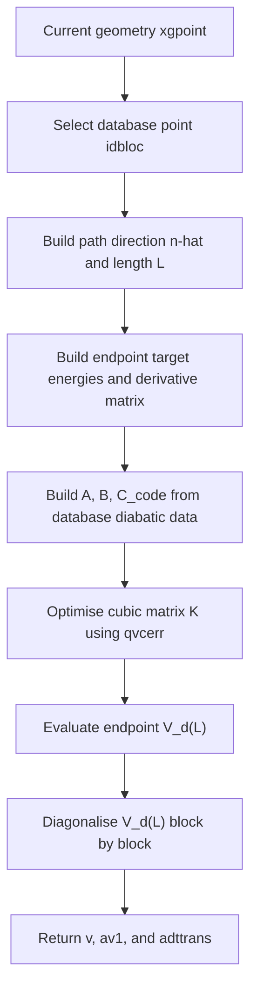

# `optqvc`

## Purpose in one paragraph

`optqvc` constructs a one-dimensional cubic diabatic path model between a
selected database point and the current geometry. It fixes the constant,
linear, and quadratic path coefficients from the database diabatic energy,
gradient, and Hessian data, then optimises only the symmetric cubic
coefficient matrix so that the endpoint model reproduces the supplied target
adiabatic energies and projected adiabatic derivative matrix. The optimised
endpoint model is then diagonalised to obtain a fallback transformation
matrix for the current geometry.

This routine is used as an implementation fallback when the normal
straight-line propagation of the ADT matrix is considered unsafe, for example in a possible state-flip or seam-crossing region.

## Where it sits in the workflow

In the propagation-diabatisation workflow, `optqvc` sits after the database
prediction and safety-check stage, and before the final transformation of
adiabatic QC data into diabatic data.



### Inputs

``` fortran
subroutine optqvc(xgpoint,v,av,aderiv1,dercp,adttrans,av1,idbloc)
``` 

`xgpoint(ndofddpes)`:Current geometry in the DD-PES coordinate space.
idbloc:Index of the selected database point. The path starts at