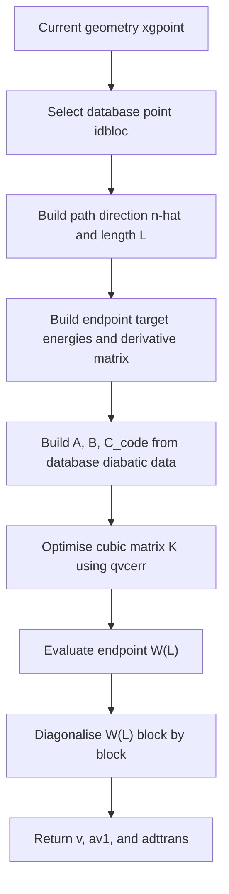

# `optqvc`

## Purpose in one paragraph

`optqvc` constructs a one-dimensional cubic diabatic path model between a
selected database point and the current geometry. It fixes the constant,
linear, and quadratic path coefficients from the database diabatic energy,
gradient, and Hessian data, then optimises only the symmetric cubic
coefficient matrix so that the endpoint model reproduces the supplied target
adiabatic energies and projected adiabatic derivative matrix. The optimised
endpoint model is then diagonalised to obtain a fallback transformation
matrix for the current geometry.

This routine is used as an implementation fallback when the normal
straight-line propagation of the ADT matrix is considered unsafe, for example in a possible state-flip or seam-crossing region.

## Where it sits in the workflow

In the propagation-diabatisation workflow, `optqvc` sits after the database
prediction and safety-check stage, and before the final transformation of
adiabatic QC data into diabatic data.



### Inputs

``` fortran
subroutine optqvc(xgpoint,v,av,aderiv1,dercp,adttrans,av1,idbloc)
``` 

`xgpoint(ndofddpes)`:
Current geometry in the DD-PES coordinate space.
`idbloc`:
Index of the selected database point. The path starts at

 $$\Rv_0=\verb|dbgeo(:,idbloc)|$$

 and ends at 

 $$\Rv=\verb|xgpoit|$$

 `av(nddstate, nddstate)`: 
 Endpoint target energy matrix as supplied by the caller. Inside `optqvc`, only the diagonal is used:

 ``` fortran
 hadv(s) = av(s,s)
 ```

 which are the target adiabatic energies.

`aderiv1(ndofddpes,nddstate,nddstate)`
Endpoint adiabatic gradient data. The diagonal elements are projected along the path direction to give

$$\nabla V_i\cdot\mat{\hat n}  $$

`dercp(ndofddpes,nactdim)`
Endpoint off-diagonal derivative data. In this routine it is used as a symmetric derivative-coupling numerator-like object,


$$\D_{ij}=\mel{\psi_i}{\nabla\hat H_{el}}{\psi_j}$$

projected along $\mat{\hat n}$. Note it is not treated here as the antisymmetric NACV $\F_{ij}$. Note the code declares this argument as intent(inout), but in the routine it is only read.

### Outputs

`v(nddstate,nddstate)`
The optimised cubic diabatic model matrix evaluated at the current geometry:

$$
\W(L)
=\mat A+\mat BL+\mat C_{\mathrm{code}}L^2+\mat KL^3
$$

`adttrans(nddstate,nddstate)`
Transformation matrix obtained by diagonalising the optimised endpoint model. During diagonalisation, the local eigenvector matrix $\Smat$ is stored in the orientation 

$$\Smat^T\W(L)\Smat=\V $$

At the end of the routine, `addtrans` is tranposed by (i.e. storing the familiar $\Cmat$ as $\Smat^T=\Cmat$):

```fortran
call tranqxd(adttrans,nddstate)
```

so the returned orientation is the one expected by the downstream `transform` routine, not necessarily the abstract orientation used in the theory pages.

`av1(nddstate)`
Model adiabatic eigenvalues obtained from diagonalising the optimised endpoint model.

### Important globals / module data

The routine uses database data:

```fortran
dbgeo
dbener
dbgrad
dbhess
```

and module-level work arrays:

```fortran
hadv
hadd
diva
divb
divc
qvclength
nqvcpar
```

The arrays `hadv`, `hadd`, `diva`, `divb`, and `divc` are filled in `optqvc` and then read by the optimisation callback `qvcerr`.


### Step-by-step walkthrough

#### 1. Define the one-dimensional path

``` fortran
intvec = xgpoint-dbgeo(1:ndofddpes,idbloc)
call normvxd(intvec,steplength,ndofddpes)
nintvec = intvec / steplength
```

this defines the quantities (as defined in [derivations_qvc_path_model](../derivations/derivations_qvc_path_model.md))

$$
\Delta \Rv = \Rv-\Rv_0,
\qquad
L = |\Delta \Rv|,
\qquad
\hat n = \frac{\Delta \Rv}{L}.
$$

The path coordinate is $x\in[0,L]$

### 2. Store endpoint target energies

``` fortran
do s=1,nddstate
   hadv(s) = av(s,s)
enddo
```
The optimiser compares the model eigenvalues at $x=L$ against these target values.

$$\Gadiab_{ii}$$

### 3. Build the endpoint target projected derivative matrix

For diagonal elements:

``` fortran
call vvtxdd(aderiv1(:,s,s),nintvec,deriv1a(s,s),ndofddpes)
```

This gives

$$\G^{\text{(a)},\text{target}}_{ii} = \Gadiab_{ii}\cdot\mat{\hat n}$$

For off-diagonal elements:

``` fortran
call vvtxdd(dercp(:,idx),nintvec,deriv1a(s1,s),ndofddpes)
deriv1a(s,s1) = deriv1a(s1,s)
```

This gives the projected derivative-coupling numerator-like quantity

$$\G_{ij}^{(\text{a}),\text{target}} = \D_{ij} \cdot \hat{n}.$$

The code stores this matrix symmetrically in `hadd`.

### 4. Build fixed path coefficients from the database point

The constant term is copied from the stored diabatic energy matrix

``` fortran
a(:,:) = dbener(:,:,idbloc)
```

The linear coefficient is the projected database diabatic gradient:

$$\mat B_{ij} = \Gdiab_{ij}(R_0) \cdot \mat{\hat{n}}.$$

The quadratic code coefficient is the projected database diabatic Hessian:

$$C_{\text{code},ij} = \mat{\hat{n}}^T \Hdiab_{ij}(R_0) \mat{\hat{n}}.$$

In the code this coefficient is used directly as the multiplier of $x^2$.


### 5. Store the fixed coefficients for the callback

``` fortran
diva(:,:) = a(:,:)
divb(:,:) = b(:,:)
divc(:,:) = c(:,:)
```

These arrays are read by `qvcerr(qvcpar)`.

### 6. Pack the cubic coefficient matrix

The only optimised object is the symmetric cubic matrix $\mat{K}$. The number of independent parameters is

$$N_{\text{par}} = \frac{N(N+1)}{2}.$$

For three states, `cpqvc2par` unpacks the vector as

`qvcpar = [K11, K21, K31, K22, K32, K33]`

using the loop order in `cpqvc2par`.

### 7. Optimise the cubic matrix


``` fortran
iter = 40
tol = 1.0d-6
qvclength = steplength
fret = qvcerr(qvcpar)

call frprmn(qvcpar,nqvcpar,tol,iter,fret,qvcerr,dqvcerr, &
            ilog,0.0_dop,0)
```


`frprmn` is a conjugate-gradient optimiser. The objective is `qvcerr`; the gradient routine `dqvcerr` is treated separately and is evaluated numerically by finite differences.

### 8. Objective evaluated by `qvcerr`

For a trial cubic matrix $\mat{K}$, `qvcerr` evaluates

$$\W(L) = \mat{A} + \mat{B} L + \mat{C}_{\text{code}} L^2 + \mat{K} L^3$$

and

$$\W'(L) = \mat{B} + 2\mat{C}_{\text{code}} L + 3\mat{K} L^2.$$

It then diagonalises $\W(L)$ block by block (spin block)

``` Fortran
call dsyev('V','U',imultblk(idx),transtmp,imultblk(idx), &
           tmpe,work,3*imultblk(idx),info)
call trmatphase(transtmp,imultblk(idx))
```


The eigenvectors form a matrix $\mat{S}$ satisfying

$$\mat{S}^T \W(L) \mat{S} = \text{diag}(V_i^{\text{model}}).$$

The derivative matrix is transformed into the model adiabatic basis:

$$\Gmat^{(\text{a}),\text{model}} = \mat{S}^T \W'(L) \mat{S}.$$

The error is

$$\epsilon = \left[ \sum_i \left( V_i^{\text{model}} - V_i^{\text{target}} \right)^2 + \sum_{i \le j} \left( G_{ij}^{(a),\text{model}} - G_{ij}^{(a),\text{target}} \right)^2 \right]^{1/2}.$$

The code uses this mixed norm directly, with no explicit weighting between energy errors and derivative/numerator errors.

### 9. Evaluate the final endpoint diabatic model

After optimisation, the cubic parameters are unpacked and the endpoint diabatic matrix is written to `v`:

``` fortran
v(s,s) = a(s,s) + b(s,s)*steplength
         + c(s,s)*steplength**2
         + d(s,s)*steplength**3
```
with analogous assignments for off-diagonal elements.

### 10. Diagonalise the final model and return the transformation

The final `v` is diagonalised block by block in spin multiplicity. The routine stores the eigenvalues in `av1`, fixes eigenvector phases using `trmatphase`, stores the eigenvectors into `adttrans`, and finally transposes `adttrans` using `tranqxd`.

<!-- ### Implementation caveats
1. `dercp` is declared intent(inout) but is only read in the shown code.
3. `av` is used as a target energy container; the meaning of that target must be documented on the caller page.
3. `C_{\mathrm{code}}` is used as the coefficient of $x^2$, not as $\frac{1}{2}\mat{H}$ unless dbhess already stores a half-Hessian convention.
4. The objective mixes energy and derivative/numerator errors without weights.
5. `qvcerr` does not appear to initialise trans1 to zero before filling spin blocks. If `nsmult > 1`, off-block entries should be checked carefully.
6. The routine assumes `steplength` is nonzero.
7. The routine does not visibly check the info flag returned by dsyev.
8. `trmatphase` fixes eigenvector signs, but it does not by itself solve state matching or permutation issues if the endpoint eigenvalue ordering is ambiguous. -->