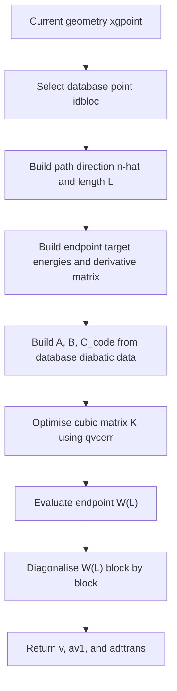

# `optqvc`

## Purpose in one paragraph

`optqvc` constructs a one-dimensional cubic diabatic path model between a
selected database point and the current geometry. It fixes the constant,
linear, and quadratic path coefficients from the database diabatic energy,
gradient, and Hessian data, then optimises only the symmetric cubic
coefficient matrix so that the endpoint model reproduces the supplied target
adiabatic energies and projected adiabatic derivative matrix. The optimised
endpoint model is then diagonalised to obtain a fallback transformation
matrix for the current geometry.

This routine is used as an implementation fallback when the normal
straight-line propagation of the ADT matrix is considered unsafe, for example in a possible state-flip or seam-crossing region.

## Where it sits in the workflow

In the propagation-diabatisation workflow, `optqvc` sits after the database
prediction and safety-check stage, and before the final transformation of
adiabatic QC data into diabatic data.



### Inputs

``` fortran
subroutine optqvc(xgpoint,v,av,aderiv1,dercp,adttrans,av1,idbloc)
``` 

`xgpoint(ndofddpes)`:
Current geometry in the DD-PES coordinate space.
`idbloc`:
Index of the selected database point. The path starts at

 $$\Rv_0=\verb|dbgeo(:,idbloc)|$$

 and ends at 

 $$\Rv=\verb|xgpoit|$$

 `av(nddstate, nddstate)`: 
 Endpoint target energy matrix as supplied by the caller. Inside `optqvc`, only the diagonal is used:

 ``` fortran
 hadv(s) = av(s,s)
 ```

 which are the target adiabatic energies.

`aderiv1(ndofddpes,nddstate,nddstate)`
Endpoint adiabatic gradient data. The diagonal elements are projected along the path direction to give

$$\nabla V_i\cdot\mat{\hat n}  $$

`dercp(ndofddpes,nactdim)`
Endpoint off-diagonal derivative data. In this routine it is used as a symmetric derivative-coupling numerator-like object,


$$\D_{ij}=\mel{\psi_i}{\nabla\hat H_{el}}{\psi_j}$$

projected along $\mat{\hat n}$. Note it is not treated here as the antisymmetric NACV $\F_{ij}$. Note the code declares this argument as intent(inout), but in the routine it is only read.

### Outputs

`v(nddstate,nddstate)`
The optimised cubic diabatic model matrix evaluated at the current geometry:

$$
\W(L)
=\mat A+\mat BL+\mat C_{\mathrm{code}}L^2+\mat KL^3
$$

`adttrans(nddstate,nddstate)`
Transformation matrix obtained by diagonalising the optimised endpoint model. During diagonalisation, the local eigenvector matrix $\Smat$ is stored in the orientation 

$$\Smat^T\W(L)\Smat=\V $$

At the end of the routine, `addtrans` is tranposed by (i.e. storing the familiar $\Cmat$ as $\Smat^T=\Cmat$):

```fortran
call tranqxd(adttrans,nddstate)
```

so the returned orientation is the one expected by the downstream `transform` routine, not necessarily the abstract orientation used in the theory pages.

`av1(nddstate)`
Model adiabatic eigenvalues obtained from diagonalising the optimised endpoint model.

### Important globals / module data

The routine uses database data:

```fortran
dbgeo
dbener
dbgrad
dbhess
```

and module-level work arrays:

```fortran
hadv
hadd
diva
divb
divc
qvclength
nqvcpar
```

The arrays `hadv`, `hadd`, `diva`, `divb`, and `divc` are filled in `optqvc` and then read by the optimisation callback `qvcerr`.


### Step-by-step walkthrough

#### 1. Define the one-dimensional path

``` fortran
intvec = xgpoint-dbgeo(1:ndofddpes,idbloc)
call normvxd(intvec,steplength,ndofddpes)
nintvec = intvec / steplength
```

this defines