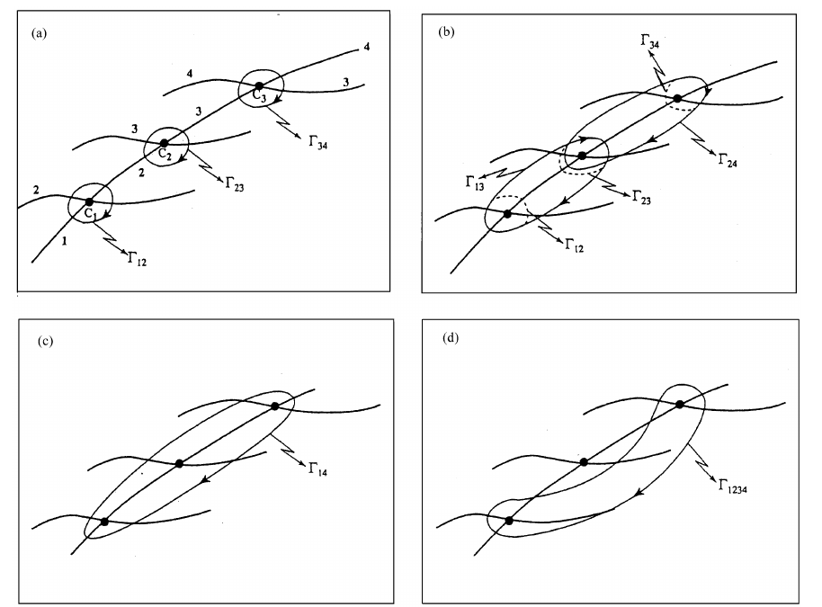

---

## Geometrical interpretation of sign flips

[Multistate topology, signs, and degeneracies](spec08_multistate_topology_signs.md) described the allowed sign patterns in terms of the full topological matrix. This page gives the corresponding geometric interpretation for separated adjacent conical intersections. The limitation of that geometric picture for genuine multistate degeneracies is taken up in [Degeneracy](spec11_degeneracy.md).

The diagonal entries of the topological matrix tell us which adiabatic electronic eigenfunctions change sign after a closed circuit. For real electronic states, the allowed diagonal topological matrix has the form

$$
\begin{align}
\mat D(\Gamma)
=
\operatorname{diag}
(d_1,d_2,\ldots,d_M),
\qquad
d_i=\pm 1.
\end{align}
$$

If $d_i=-1$, the $i$-th adiabatic eigenfunction changes sign after transport around the closed contour $\Gamma$. If $d_i=+1$, it returns with the same sign.

It is important to say exactly what is changing sign. The potential energy surface $V_i$ does not change sign. Rather, the real adiabatic electronic eigenfunction $\ket{\psi_i}$ may return as

$$
\begin{align}
\ket{\psi_i}
\longrightarrow
-\ket{\psi_i}.
\end{align}
$$

This sign change is allowed because a real electronic eigenfunction is defined only up to an overall sign. The nontrivial statement is that these signs cannot always be chosen continuously around a loop that surrounds a conical intersection.

---

### Adjacent-state conical intersections

Baer's geometrical picture assumes a sequence of ordered adiabatic states,

$$
\begin{align}
1,2,3,\ldots,M,
\end{align}
$$

and conical intersections between neighbouring states. We denote by $C_j$ the conical intersection between states $j$ and $j+1$:

$$
\begin{align}
C_j:
\qquad
\psi_j
\leftrightarrow
\psi_{j+1}.
\end{align}
$$

Thus,

$$
\begin{array}{c|c}
\text{CI} & \text{states involved}\\
\hline
C_1 & 1,2\\
C_2 & 2,3\\
C_3 & 3,4\\
\vdots & \vdots
\end{array}
$$

A contour that surrounds only $C_j$ flips the signs of exactly the two states involved in that conical intersection:

$$
\begin{align}
C_j
\quad\Rightarrow\quad
\ket{\psi_j}\mapsto -\ket{\psi_j},
\qquad
\ket{\psi_{j+1}}\mapsto -\ket{\psi_{j+1}}.
\end{align}
$$

In terms of the topological matrix,

$$
\begin{align}
\mat D_j
=
\operatorname{diag}
(1,\ldots,1,
-1,
-1,
1,\ldots,1),
\end{align}
$$

where the two $-1$ entries are in positions $j$ and $j+1$.

This is the same two-state sign-change rule, but embedded in an $M$-state electronic space.

---

### A useful graph picture

The simplest way to remember the multistate sign rule is to draw the states as vertices and the conical intersections as edges:

$$
\begin{align}
1
\;-\; C_1 \;-\;
2
\;-\; C_2 \;-\;
3
\;-\; C_3 \;-\;
4
\;-\;\cdots .
\end{align}
$$

A closed contour may surround one or more of the conical intersections $C_j$. Each enclosed $C_j$ flips the two eigenfunctions at the ends of that edge.

Therefore, a state flips sign if it belongs to an odd number of enclosed conical intersections. If it belongs to an even number of enclosed conical intersections, it flips an even number of times and returns unchanged.

Let

$$
\begin{align}
N_j(\Gamma)
=
\begin{cases}
1, & \text{if the contour } \Gamma \text{ surrounds } C_j,\\
0, & \text{otherwise}.
\end{cases}
\end{align}
$$

For convenience set

$$
\begin{align}
N_0=N_M=0.
\end{align}
$$

The $i$-th eigenfunction is adjacent to $C_{i-1}$ and $C_i$. Thus its sign factor is

$$
\begin{align}
d_i(\Gamma)
=
(-1)^{N_{i-1}(\Gamma)+N_i(\Gamma)}.
\label{eq:sign_factor_adjacent_ci}
\end{align}
$$

This equation is the geometrical version of the diagonal $D$-matrix rule.

It says:

$$
\boxed{
\text{a state changes sign if the contour encloses an odd number of CIs touching that state.}
}
$$

---

### One enclosed conical intersection

If the contour surrounds only $C_j$, then

$$
\begin{align}
N_j=1,
\qquad
N_k=0
\quad
(k\neq j).
\end{align}
$$

Using Eq. $\eqref{eq:sign_factor_adjacent_ci}$,

$$
\begin{align}
d_j=-1,
\qquad
d_{j+1}=-1,
\end{align}
$$

and all other $d_i=+1$. Thus the contour flips exactly two eigenfunctions.

For example, for four states, a contour around $C_2$ gives

$$
\begin{align}
\mat D(C_2)
=
\operatorname{diag}
(+1,-1,-1,+1).
\end{align}
$$

The number of sign-flipped eigenfunctions is

$$
\begin{align}
K=2.
\end{align}
$$

---

### Two consecutive conical intersections

Now suppose the contour surrounds two consecutive conical intersections, $C_j$ and $C_{j+1}$.

Then the affected edges are

$$
\begin{align}
j
\;-\; C_j \;-\;
j+1
\;-\; C_{j+1} \;-\;
j+2.
\end{align}
$$

The sign flips are:

$$
\begin{array}{c|c}
\text{state} & \text{number of flips}\\
\hline
j & 1\\
j+1 & 2\\
j+2 & 1
\end{array}
$$

Therefore state $j+1$ changes sign twice and returns unchanged. Only the two outer states flip:

$$
\begin{align}
d_j=-1,
\qquad
d_{j+1}=+1,
\qquad
d_{j+2}=-1.
\end{align}
$$

Thus a contour surrounding a consecutive block of two CIs flips the two endpoint eigenfunctions.

For example, a contour surrounding $C_1$ and $C_2$ gives

$$
\begin{align}
\mat D(C_1+C_2)
=
\operatorname{diag}
(-1,+1,-1,\ldots).
\end{align}
$$

This is the point that is easy to miss in Baer's discussion. The middle eigenfunction is involved in both conical intersections, so its sign changes twice:

$$
\begin{align}
(-1)\times(-1)=+1.
\end{align}
$$

---

### A consecutive block of conical intersections

The same argument extends immediately. Suppose the contour surrounds a consecutive block

$$
\begin{align}
C_j,C_{j+1},\ldots,C_{n-1}.
\end{align}
$$

This block connects the states

$$
\begin{align}
j,j+1,\ldots,n.
\end{align}
$$

Every interior state belongs to two enclosed conical intersections. Therefore every interior state flips twice and is unchanged. Only the two endpoints flip:

$$
\begin{align}
d_j=-1,
\qquad
d_n=-1,
\end{align}
$$

while

$$
\begin{align}
d_{j+1}
=
d_{j+2}
=
\cdots
=
d_{n-1}
=
+1.
\end{align}
$$

This is Baer's contour algebra written in sign language. If $\Gamma_{j,n}$ denotes a contour surrounding the consecutive block from $C_j$ through $C_{n-1}$, then

$$
\begin{align}
\Gamma_{j,n}
=
\sum_{k=j}^{n-1}
\Gamma_{k,k+1}.
\end{align}
$$

The corresponding sign rule is

$$
\boxed{
\Gamma_{j,n}
\text{ flips only the signs of states } j \text{ and } n.
}
$$

For example, in a four-state chain, a contour surrounding all three adjacent conical intersections $C_1,C_2,C_3$ gives

$$
\begin{align}
\mat D(C_1+C_2+C_3)
=
\operatorname{diag}
(-1,+1,+1,-1).
\end{align}
$$

States $2$ and $3$ each participate in two enclosed CIs, so they do not change sign.

---

### Non-consecutive conical intersections

A different situation occurs when a contour surrounds two non-consecutive conical intersections, for example $C_j$ and $C_k$ with

$$
\begin{align}
k>j+1,
\end{align}
$$

but does not surround the conical intersections between them.

Then the contour encloses two disconnected edges in the state graph:

$$
\begin{align}
j
\;-\; C_j \;-\;
j+1,
\qquad
k
\;-\; C_k \;-\;
k+1.
\end{align}
$$

Now there is no shared middle state that flips twice. The four endpoint states each flip once:

$$
\begin{align}
d_j=d_{j+1}=d_k=d_{k+1}=-1.
\end{align}
$$

Thus a contour surrounding two separated CIs flips four eigenfunctions.

For example, in a four-state system, suppose the contour surrounds $C_1$ and $C_3$, but not $C_2$. Then

$$
\begin{align}
\mat D(C_1+C_3)
=
\operatorname{diag}
(-1,-1,-1,-1).
\end{align}
$$

All four electronic eigenfunctions change sign.

This is why Baer distinguishes contours that surround a consecutive chain of CIs from contours that surround separated CIs. The number of enclosed CIs alone is not enough. What matters is how those CIs are connected along the ordered state chain.

---

### General rule

Let the set of enclosed conical intersections be decomposed into connected blocks. Each connected block has two endpoints. Only those endpoints flip.

Therefore, if the enclosed CIs form $r$ disconnected blocks, the number of sign-flipped eigenfunctions is

$$
\begin{align}
K=2r.
\end{align}
$$

This immediately explains why $K$ is always even in this real multistate picture. The sign flips come in endpoint pairs.

Equivalently, using Eq. $\eqref{eq:sign_factor_adjacent_ci}$,

$$
\begin{align}
\mat D(\Gamma)
=
\operatorname{diag}
\left(
(-1)^{N_0+N_1},
(-1)^{N_1+N_2},
\ldots,
(-1)^{N_{M-1}+N_M}
\right),
\end{align}
$$

with $N_0=N_M=0$.

This compact formula is often the clearest way to interpret Baer's contour algebra.

---

### Common pitfall

A common mistake is to say:

> The contour encloses two conical intersections, so four states must flip.

This is true only if the two CIs are non-consecutive. If the two CIs are consecutive, the middle state is shared by both intersections and flips twice. Therefore only the two outer states flip.

The correct statement is:

$$
\boxed{
\text{sign flips occur at the boundary of the enclosed CI block.}
}
$$

The word "boundary" here means the states that are touched by exactly one enclosed conical intersection.

---

<!-- ## Multi-degenerate points

The preceding discussion assumes that the conical intersections are separated. Baer next asks what happens when two or more such two-state conical intersections collapse to the same nuclear geometry.

The simplest case is a three-state situation. Suppose the lowest two states form a conical intersection $C_1$, and the second and third states form a conical intersection $C_2$. If these two conical intersections are separated, then a contour surrounding both gives

$$
\begin{align}
\mat D(C_1+C_2)
=
\operatorname{diag}
(-1,+1,-1).
\end{align}
$$

The second eigenfunction participates in both CIs, so it changes sign twice and remains unchanged.

Now imagine moving the two CIs together until they coincide at the same point. In the limiting picture, a closed contour around the coincident point surrounds both $C_1$ and $C_2$. If the coincidence is just the limit of two ordinary neighbouring CIs, then the same sign rule should persist:

$$
\begin{align}
\mat D
=
\operatorname{diag}
(-1,+1,-1).
\end{align}
$$

Thus only the two outer eigenfunctions change sign.

This is the sense in which Baer says that extending the argument to a point where $n$ surfaces intersect does not change the final result: if the multi-degeneracy is understood as a collapsed chain of ordinary adjacent two-state CIs, then a contour around the collapsed object flips only the two endpoint states of the chain. -->

<!-- For example, if the collapsed object represents

$$
\begin{align}
C_1+C_2+\cdots+C_{n-1},
\end{align}
$$

then the expected sign pattern is

$$
\begin{align}
d_1=-1,
\qquad
d_n=-1,
\end{align}
$$

with all interior states unchanged. -->

<!-- ---

### Why this appears to contradict some multistate model results

Baer points out that this conclusion can appear to contradict the explicit multistate model analyses. In some special three-state or four-state models, the allowed topological matrices did not include the sign pattern predicted by simply collapsing a chain of two-state CIs. For example, a model may allow either no sign flips or all four sign flips, but not a two-function sign flip.

The resolution is that these are not the same physical situation.

The collapsed-chain argument assumes that the multi-degenerate point is continuously connected to a nearby situation in which the degeneracy splits into ordinary two-state conical intersections. In other words, there must be additional nuclear coordinates that can separate the coincident CIs.

If no such coordinates are available, the degeneracy is not simply a compressed version of several ordinary CIs. It is a genuinely multistate degeneracy with its own topology. The ordinary adjacent-CI contour algebra is then not enough.

---

### Breakable and unbreakable multi-degeneracies

Baer distinguishes two types of multi-degeneracy.

A **breakable multi-degeneracy** is one that can be unfolded into several ordinary two-state conical intersections by changing suitable nuclear coordinates. In this case, the coincident point is best viewed as a limiting case of separated CIs.

For a breakable multi-degeneracy,

$$
\begin{align}
\text{coincident multi-state point}
\quad
\longrightarrow
\quad
\text{separated adjacent two-state CIs}
\end{align}
$$

under a small perturbation in the appropriate coordinates.

Then the sign pattern can be understood using the same endpoint rule as before. If the contour surrounds the whole collapsed block, only the endpoint eigenfunctions flip.

An **unbreakable multi-degeneracy** is different. It is not formed by assembling ordinary two-state CIs and cannot be unfolded into such CIs by small coordinate changes. Its topology is intrinsic to the multistate degeneracy itself.

In such a case, the sign rules must be obtained from the full multistate ADT/topological matrix analysis, not from the adjacent-CI chain picture.

---

### Internal and external coordinates

Baer describes this distinction using the idea of internal and external coordinates.

The internal coordinates are the coordinates directly involved in creating or describing the degeneracy. They are the coordinates in which the intersecting states meet.

The external coordinates are additional nuclear coordinates that can move or split the degeneracy without being part of the minimal degeneracy description.

For a breakable multi-degeneracy, varying suitable external coordinates separates the coincident point into ordinary conical intersections. Therefore the ordinary two-state CI algebra can be recovered.

For an unbreakable multi-degeneracy, no such external coordinate can unfold the degeneracy into ordinary two-state CIs. The multi-state character is essential.

This distinction is useful because it prevents one from applying the two-state CI sign rule too broadly. A multi-state degeneracy may look like several conical intersections sitting on top of one another, but that interpretation is valid only if the degeneracy can actually be unfolded into separated two-state intersections.

--- -->

### Interpretation

<!-- The geometrical sign-flip picture can be summarised as follows.

For separated adjacent conical intersections, each CI flips the two states that meet at that CI. If a state is shared by two enclosed CIs, it flips twice and remains unchanged. Therefore a contour around a connected block of adjacent CIs flips only the endpoint states of that block. -->

Baer's geometrical sign-flip picture can be summarised as a parity rule on a chain of adiabatic states. A conical intersection $C_j$ between states $j$ and $j+1$ flips both corresponding eigenfunctions. If a contour encloses several adjacent CIs, any state lying between two enclosed CIs flips twice and is unchanged. Thus a contour around a connected block $C_j,\ldots,C_{n-1}$ flips only the two endpoint states $j$ and $n$. If the enclosed CIs are separated rather than consecutive, each disconnected block contributes two endpoint sign flips. 

However, [Degeneracy](spec11_degeneracy.md) explains why multi-degenerate points require an additional distinction: if the degeneracy can be unfolded into separated ordinary two-state CIs, the same endpoint rule applies in the limiting case; if it cannot, the full multistate topological matrix must be analysed directly. Therefore, the $D$-matrix sign pattern is not determined merely by counting how many conical intersections lie inside a contour. It is determined by which electronic eigenfunctions are touched an odd number of times by the enclosed degeneracy structure.

---

### Links to related notes

- [Multistate topology, signs, and degeneracies](spec08_multistate_topology_signs.md)
- [Degeneracy](spec11_degeneracy.md)
- [Three-state sign flips and topological matrix](../worked_examples/adt_topology/example02_three_state_sign_flips_and_D_matrix.md)
- [Four-state topological matrix and quantisation conditions](../worked_examples/adt_topology/example03_four_state_loop_and_D_matrix.md)

