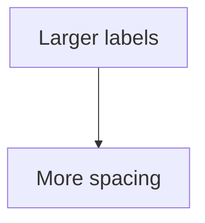

# Style SCSS Guide

Use this guide when editing `assets/css/style.scss`. It explains the local CSS/SCSS conventions used by this site, the basic syntax, and a reusable pattern for adding page-specific styling without affecting every page.

## Where The Styling Lives

The main stylesheet is:

```text
assets/css/style.scss
```

Jekyll turns this file into the final site CSS during the build. The file starts with front matter and imports the Cayman theme:

```scss
---
---
@import "{{ site.theme }}";
```

The front matter tells Jekyll to process the file. The import loads the theme first. Rules written below the import override or extend the theme.

## Basic CSS Shape

A CSS rule has a selector and one or more declarations:

```scss
.example-box {
    margin: 2rem 0;
    padding: 1rem;
    border: 1px solid #d8e4ea;
}
```

Here:

- `.example-box` is the selector.
- `margin`, `padding`, and `border` are properties.
- `2rem 0`, `1rem`, and `1px solid #d8e4ea` are values.
- Each declaration ends with a semicolon.

## Selector Basics

Class selectors start with a dot:

```scss
.knowledge-map-frame {
    overflow-x: auto;
}
```

This applies to HTML like:

```html
<div class="knowledge-map-frame">
  ...
</div>
```

Element selectors target normal HTML tags:

```scss
strong, b {
    font-weight: 1000;
}
```

This targets both `<strong>` and `<b>`.

Descendant selectors target something inside something else:

```scss
.knowledge-map-frame .mermaid svg {
    max-width: none;
}
```

This means: find an `svg` inside an element with class `mermaid`, where that `mermaid` element is inside `knowledge-map-frame`.

State selectors target interaction states:

```scss
.page-breadcrumb a:hover,
.page-breadcrumb a:focus {
    text-decoration: underline;
}
```

This applies when a breadcrumb link is hovered or keyboard-focused.

## Common CSS And SCSS Syntax

CSS and SCSS are mostly made from selectors, braces, properties, values, and conditions. This table explains the syntax that appears most often in this site.

| Syntax | What it means | Example | Rendering effect |
| --- | --- | --- | --- |
| `.class-name` | Select elements with a matching `class=""` | `.page-toc` | Styles only elements marked with `class="page-toc"`. |
| `element` | Select built-in HTML elements by tag name | `strong` | Styles every `<strong>` element. |
| `selector-a, selector-b` | Apply the same rule to multiple selectors | `strong, b` | Makes both `<strong>` and `<b>` render the same way. |
| `.a .b` | Descendant selector: find `.b` somewhere inside `.a` | `.knowledge-map-frame .mermaid` | Affects Mermaid diagrams only inside the knowledge-map frame. |
| `.a.b` | Compound selector: same element must have both classes | `.page-toc.is-ready` | Styles the TOC only after JavaScript adds `is-ready` to the TOC itself. |
| `a:hover` | Pseudo-class for mouse hover state | `.page-breadcrumb a:hover` | Underlines breadcrumb links while hovered. |
| `a:focus` | Pseudo-class for keyboard focus state | `.page-breadcrumb a:focus` | Underlines links when reached by keyboard navigation. |
| `{ ... }` | Rule body | `.page-toc { display: none; }` | Holds the declarations applied by the selector. |
| `property: value;` | One styling instruction | `display: flex;` | Changes one visual/layout behaviour. |
| `// comment` | SCSS-only comment | `// Footer link row.` | Helps maintainers; not emitted as final CSS. |
| `/* comment */` | CSS comment | `/* note */` | Valid CSS comment; can appear in generated CSS. |
| `@import` | Load another stylesheet | `@import "{{ site.theme }}";` | Loads the Cayman theme before local overrides. |
| `@media` | Apply rules only under conditions | `@media screen and (max-width: 640px)` | Changes layout only on matching screen widths. |
| `!important` | Give a declaration extra priority | `font-weight: 1000 !important;` | Overrides competing theme rules more forcefully. |

### Syntax Examples And Rendering

Class selector:

```scss
.site-footer-custom {
    color: #60717d;
}
```

This reads  "find the element with class `site-footer-custom`, and make its text muted grey."

Element selector:

```scss
.main-content img {
    max-width: 100%;
    height: auto;
}
```

This reads  "for images inside the main content column, never let them grow wider than their container, and keep their height proportional."

Compound selector:

```scss
.page-toc.is-ready {
    display: block;
}
```

This reads  "show an element only when the same element has both `page-toc` and `is-ready` classes."

Pseudo-class selector:

```scss
.site-footer-custom__links a:hover,
.site-footer-custom__links a:focus {
    text-decoration: underline;
}
```

This reads  "underline footer links when the reader hovers over them or focuses them with the keyboard."

Media query:

```scss
@media screen and (max-width: 640px) {
    .prev-next__link,
    .prev-next__link--next {
        text-align: left;
    }
}
```

This reads  "on narrow screens, align both previous and next navigation cards to the left."

If a syntax entry does not have a visible rendering effect by itself, it is because it is structural. For example, braces `{}` and semicolons `;` do not create a style on their own; they make the stylesheet readable to the browser so the declarations inside can take effect.

## Page-Specific Styling

Prefer page-specific wrappers when one page needs special layout. This avoids making all theory pages wider or changing every Mermaid diagram.

Example in a Markdown page:

````md
<div class="knowledge-map-frame" markdown="1">


</div>
````

Then in `assets/css/style.scss`:

```scss
.knowledge-map-frame {
    position: relative;
    left: 50%;
    width: min(1500px, calc(100vw - 3rem));
    margin: 2rem 0;
    transform: translateX(-50%);
    overflow-x: auto;
}
```

The wrapper affects only that block, not the whole site.

Important: close the wrapper with `</div>`. If the closing tag is missing, the rest of the page may also be treated as part of the frame.

## Mermaid-Specific Notes

For Mermaid diagrams, CSS can change the frame around the diagram, but Mermaid itself decides the graph layout. If the node text is too small, set Mermaid options inside that diagram:



This is usually better than forcing text size with CSS because Mermaid recalculates node sizes and spacing before drawing the graph.

Use CSS for the container:

```scss
.knowledge-map-frame {
    overflow-x: auto;
}
```

Use Mermaid `init` for graph layout:

```mermaid
%%{init: {"themeVariables": {"fontSize": "22px"}}}%%
```

## Media Queries

Media queries apply CSS only under certain screen conditions.

This rule applies only on wide screens:

```scss
@media screen and (min-width: 1400px) {
    .page-toc.is-ready {
        position: sticky;
    }
}
```

This rule applies only on small screens:

```scss
@media screen and (max-width: 640px) {
    .main-content {
        font-size: 0.98rem;
    }
}
```

Use `min-width` when you want to add extra layout features for large screens. Use `max-width` when you want to simplify or stack things on mobile.

## Reusable Component Template

Use this pattern when adding a new styled block:

```scss
// Short comment explaining where this component appears and what it controls.
.component-name {
    margin: 2rem 0;
    padding: 1rem;
}

// A child element inside the component.
.component-name__title {
    font-size: 1.2rem;
    font-weight: 700;
}

// Interactive state.
.component-name a:hover,
.component-name a:focus {
    text-decoration: underline;
}

// Mobile adjustment.
@media screen and (max-width: 640px) {
    .component-name {
        padding: 0.75rem;
    }
}
```

The double-underscore pattern, such as `.component-name__title`, means "a named part of this component." It keeps related rules easy to find.

## Five Walkthrough Levels

### Level 1: Style A Built-In HTML Element

```scss
strong, b {
    font-weight: 1000 !important;
}
```

This reads  "find every `<strong>` element and every `<b>` element, then make the text very bold."

Connected pieces:

| Layer | Role |
| --- | --- |
| Markdown | `**important**` becomes `<strong>important</strong>`. |
| SCSS | The `strong, b` selector changes how that generated HTML looks. |
| Browser | The reader sees heavier bold text. |

### Level 2: Style A Class Added In HTML

```html
<div class="knowledge-map-frame" markdown="1">
```

This reads  "start a wrapper `div`, give it the class `knowledge-map-frame`, and let Markdown still be processed inside it."

```scss
.knowledge-map-frame {
    overflow-x: auto;
}
```

This reads  "when an element has the class `knowledge-map-frame`, add horizontal scrolling if its content is too wide."

Connected pieces:

| Layer | Role |
| --- | --- |
| Markdown page | `00_project_overview/knowledge_map.md` adds the wrapper. |
| Kramdown | `markdown="1"` keeps the Mermaid fence readable as Markdown. |
| SCSS | `.knowledge-map-frame` styles only that wrapper. |

### Level 3: Style Something Inside Something Else

```scss
.knowledge-map-frame .mermaid svg {
    max-width: none;
}
```

This reads  "find an `svg` inside a `.mermaid` element, but only when that Mermaid element is inside `.knowledge-map-frame`; do not force that SVG to shrink to the normal content width."

Connected pieces:

| Layer | Role |
| --- | --- |
| Markdown | A Mermaid fence defines the diagram text. |
| JavaScript | Mermaid turns the diagram into an SVG. |
| SCSS | This descendant selector changes only knowledge-map Mermaid SVGs. |

### Level 4: Let JavaScript Trigger A Style

```scss
.page-toc {
    display: none;
}

.page-toc.is-ready {
    display: block;
}
```

This reads  "hide the table of contents at first, then show it only after the same element also has the class `is-ready`."

Connected pieces:

| Layer | Role |
| --- | --- |
| HTML include | `_includes/table-of-contents.html` creates `.page-toc`. |
| JavaScript | `assets/js/page-toc.js` adds `.is-ready` after TOC links exist. |
| SCSS | The TOC appears only when it is ready to be useful. |

### Level 5: Change Layout Only At Certain Screen Widths

```scss
@media screen and (min-width: 1400px) {
    .page-toc.is-ready {
        position: sticky;
        top: 1rem;
    }
}
```

This reads  "on screens at least 1400 pixels wide, keep the ready table of contents stuck near the top as the reader scrolls."

Connected pieces:

| Layer | Role |
| --- | --- |
| SCSS media query | Applies the rule only on wide screens. |
| TOC JavaScript | Adds `.is-ready` only when enough headings exist. |
| Browser layout | Wide screens get a sticky side rail; smaller screens keep the simpler flow. |

## Common Properties

| Property | What it controls |
| --- | --- |
| `margin` | Space outside an element |
| `padding` | Space inside an element |
| `width` / `max-width` | How wide an element can be |
| `overflow-x: auto` | Adds horizontal scrolling when content is too wide |
| `display: flex` | Lays child elements out in a flexible row or column |
| `gap` | Space between flex or grid children |
| `position: sticky` | Keeps an element visible while scrolling within limits |
| `transform: translateX(-50%)` | Moves an element left by half its own width |
| `scroll-margin-top` | Offset used when jumping to headings by anchor links |

## Testing Changes

After editing `style.scss`, rebuild the site:

```powershell
bundle exec jekyll build
```

If you are tuning responsive layout, also test with:

- A wide desktop browser.
- A narrow/mobile browser width.
- A page with math.
- A page with code blocks.
- The knowledge map, if Mermaid styling changed.

## Quick Checklist

- Keep global rules, such as `.main-content`, conservative.
- Use a page-specific wrapper for one-off layouts.
- Put Mermaid layout options inside the Mermaid block when label size or spacing matters.
- Add comments above new component blocks.
- Add mobile rules with `@media screen and (max-width: 640px)` when needed.
