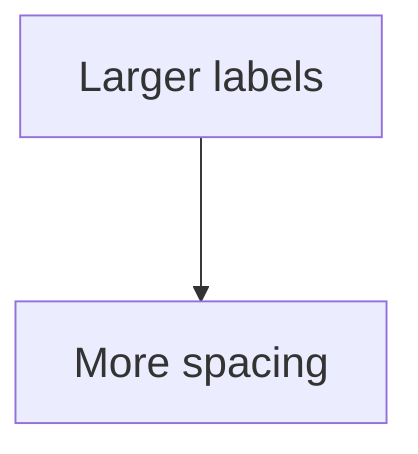

# Style SCSS Guide

Use this guide when editing `assets/css/style.scss`. It explains the local CSS/SCSS conventions used by this site, the basic syntax, and a reusable pattern for adding page-specific styling without affecting every page.

## Where The Styling Lives

The main stylesheet is:

```text
assets/css/style.scss
```

Jekyll turns this file into the final site CSS during the build. The file starts with front matter and imports the Cayman theme:

```scss
---
---
@import "{{ site.theme }}";
```

The front matter tells Jekyll to process the file. The import loads the theme first. Rules written below the import override or extend the theme.

## Basic CSS Shape

A CSS rule has a selector and one or more declarations:

```scss
.example-box {
    margin: 2rem 0;
    padding: 1rem;
    border: 1px solid #d8e4ea;
}
```

Here:

- `.example-box` is the selector.
- `margin`, `padding`, and `border` are properties.
- `2rem 0`, `1rem`, and `1px solid #d8e4ea` are values.
- Each declaration ends with a semicolon.

## Selector Basics

Class selectors start with a dot:

```scss
.knowledge-map-frame {
    overflow-x: auto;
}
```

This applies to HTML like:

```html
<div class="knowledge-map-frame">
  ...
</div>
```

Element selectors target normal HTML tags:

```scss
strong, b {
    font-weight: 1000;
}
```

This targets both `<strong>` and `<b>`.

Descendant selectors target something inside something else:

```scss
.knowledge-map-frame .mermaid svg {
    max-width: none;
}
```

This means: find an `svg` inside an element with class `mermaid`, where that `mermaid` element is inside `knowledge-map-frame`.

State selectors target interaction states:

```scss
.page-breadcrumb a:hover,
.page-breadcrumb a:focus {
    text-decoration: underline;
}
```

This applies when a breadcrumb link is hovered or keyboard-focused.

## Page-Specific Styling

Prefer page-specific wrappers when one page needs special layout. This avoids making all theory pages wider or changing every Mermaid diagram.

Example in a Markdown page:

````md
<div class="knowledge-map-frame" markdown="1">


</div>
````

Then in `assets/css/style.scss`:

```scss
.knowledge-map-frame {
    position: relative;
    left: 50%;
    width: min(1500px, calc(100vw - 3rem));
    margin: 2rem 0;
    transform: translateX(-50%);
    overflow-x: auto;
}
```

The wrapper affects only that block, not the whole site.

Important: close the wrapper with `</div>`. If the closing tag is missing, the rest of the page may also be treated as part of the frame.

## Mermaid-Specific Notes

For Mermaid diagrams, CSS can change the frame around the diagram, but Mermaid itself decides the graph layout. If the node text is too small, set Mermaid options inside that diagram:



This is usually better than forcing text size with CSS because Mermaid recalculates node sizes and spacing before drawing the graph.

Use CSS for the container:

```scss
.knowledge-map-frame {
    overflow-x: auto;
}
```

Use Mermaid `init` for graph layout:

```mermaid
%%{init: {"themeVariables": {"fontSize": "22px"}}}%%
```

## Media Queries

Media queries apply CSS only under certain screen conditions.

This rule applies only on wide screens:

```scss
@media screen and (min-width: 1400px) {
    .page-toc.is-ready {
        position: sticky;
    }
}
```

This rule applies only on small screens:

```scss
@media screen and (max-width: 640px) {
    .main-content {
        font-size: 0.98rem;
    }
}
```

Use `min-width` when you want to add extra layout features for large screens. Use `max-width` when you want to simplify or stack things on mobile.

## Reusable Component Template

Use this pattern when adding a new styled block:

```scss
// Short comment explaining where this component appears and what it controls.
.component-name {
    margin: 2rem 0;
    padding: 1rem;
}

// A child element inside the component.
.component-name__title {
    font-size: 1.2rem;
    font-weight: 700;
}

// Interactive state.
.component-name a:hover,
.component-name a:focus {
    text-decoration: underline;
}

// Mobile adjustment.
@media screen and (max-width: 640px) {
    .component-name {
        padding: 0.75rem;
    }
}
```

The double-underscore pattern, such as `.component-name__title`, means "a named part of this component." It keeps related rules easy to find.

## Common Properties

| Property | What it controls |
| --- | --- |
| `margin` | Space outside an element |
| `padding` | Space inside an element |
| `width` / `max-width` | How wide an element can be |
| `overflow-x: auto` | Adds horizontal scrolling when content is too wide |
| `display: flex` | Lays child elements out in a flexible row or column |
| `gap` | Space between flex or grid children |
| `position: sticky` | Keeps an element visible while scrolling within limits |
| `transform: translateX(-50%)` | Moves an element left by half its own width |
| `scroll-margin-top` | Offset used when jumping to headings by anchor links |

## Testing Changes

After editing `style.scss`, rebuild the site:

```powershell
bundle exec jekyll build
```

If you are tuning responsive layout, also test with:

- A wide desktop browser.
- A narrow/mobile browser width.
- A page with math.
- A page with code blocks.
- The knowledge map, if Mermaid styling changed.

## Quick Checklist

- Keep global rules, such as `.main-content`, conservative.
- Use a page-specific wrapper for one-off layouts.
- Put Mermaid layout options inside the Mermaid block when label size or spacing matters.
- Add comments above new component blocks.
- Add mobile rules with `@media screen and (max-width: 640px)` when needed.
